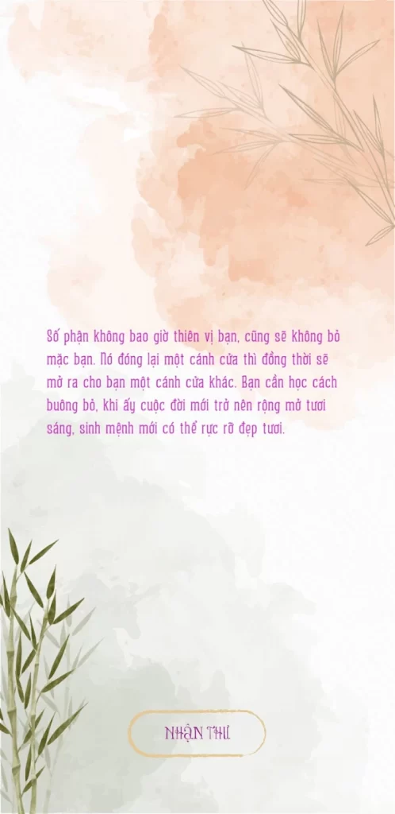

“999 lá thư gửi cho chính mình” là một ứng dụng cho phép bạn xem một bức thư ngẫu nhiên trong quyển sách cùng tên của tác giả văn học mạng Miêu Công Tử.
Ứng dụng hoàn toàn miễn phí và không có quảng cáo

Giao diện trong ứng dụng
**Tải ứng dụng tại:**
[Google Play](https://play.google.com/store/apps/details?id=com.expvn.LettersOfLife)
