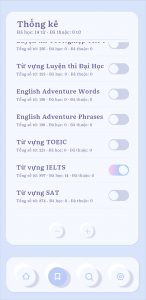
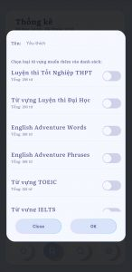
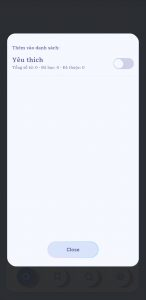
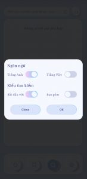
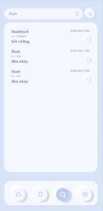

EXP Flashcards là ứng dụng học tiếng Anh có giao diện dễ nhìn và dễ dàng sử dụng. Gần 8000 từ vựng được chia ra theo các mục để phù hợp với mọi nhu cầu như:
- Luyện thi Tốt nghiệp THPT
- Luyện thi Đại học
- English Adventure Words
- English Adventure Phrases
- Từ vựng TOEIC
- Từ vựng IELTS
- Từ vựng SAT
- Từ vựng TOEFL
- Từ vựng Oxford
- Từ vựng văn phòng
- Từ vựng sinh viên
- Từ vựng sơ cấp
- Từ vựng trung cấp
- Từ vựng cao cấp

- Với mỗi từ khóa hiển thị, các bạn có thể nghe phát âm, xem giải thích ví dụ, đánh dấu đã học thuộc hoặc thêm từ vựng vào 1 danh sách mà bạn tạo.
- Trong trang danh sách, bạn sẽ thấy số lượng từ vựng đã hiển thị và đã học thuộc, bạn cũng có thể tự tạo danh sách của riêng mình từ đây
- Trong trang tìm kiếm, bạn có thể tìm theo tiếng Anh hoặc tiếng Việt sau đó cũng có thể thêm từ vựng này vào danh sách của bạn
- Ứng dụng có chức năng gửi từ vựng lên thanh thông báo, nhờ đó bạn có thể học từ vựng cả ngày mà không cần mở ứng dụng
**Tải ứng dụng:**
[GOOGLE PLAY](https://play.google.com/store/apps/details?id=com.expvn.EXPFlashcards)
