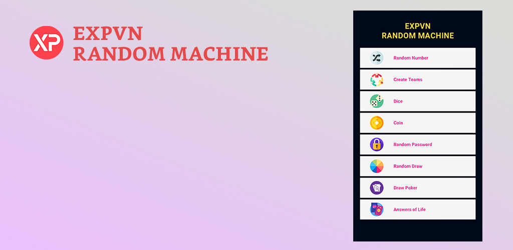

Random Machine là ứng dụng miễn phí, giúp bạn dễ dàng tạo ra các kết quả ngẫu nhiên.
Các tiện ích bên trong ứng dụng gồm:
- **Random Number:** lấy ra 1 hoặc nhiều số ngẫu nhiên trong phạm vi bạn thiết lập, có khả năng lọc hoặc không lọc kết quả trùng lặp.
- **Random Teams**: Chia đội ngẫu nhiên, người chơi được chia đều cho các đội một cách ngẫu nhiên. Có khả năng chia theo level của người chơi.
- **Dice:** đổ xúc xắc ngẫu nhiên.
- **Coin:** tung đồng xu ngẫu nhiên (gồm 2 mặt $ và €)
- **Random Password:** Tạo ra mật khẩu ngẫu nhiên với độ dài tối đa là 99, đồng thời có nhiều lựa chọn để bạn có thể có một mật khẩu ưng ý và an toàn.
- **Random Draw:** Bốc ngẫu nhiên, bạn tự tạo danh sách, sau đó tiến hành bốc thăm, có lựa chọn xóa khỏi danh sách những đối tượng đã được bốc trúng.
- **Draw Poker:** Bốc ngẫu nhiên một lá bài.
- **Answers of Life:** Một câu trả lời ngẫu nhiên cho câu hỏi của bạn. Nếu bạn có một điều gì đó cần có câu trả lời, hãy nhắm mắt và nghĩ về điều bạn muốn biết (càng cụ thể càng tốt), sau đó, bấm nút Answer để có câu trả lời (_Lưu ý: các kết quả là ngẫu nhiên và chỉ để tham khảo, bạn không nên quá lo lắng nếu kết quả là không tốt_)
**Tải ứng dụng:**
[Google Play](https://play.google.com/store/apps/details?id=com.EXPVN.RandomMachine)
