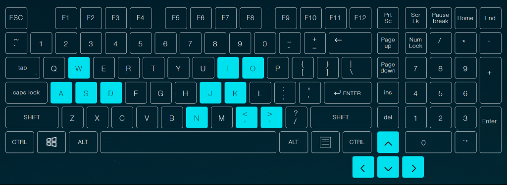
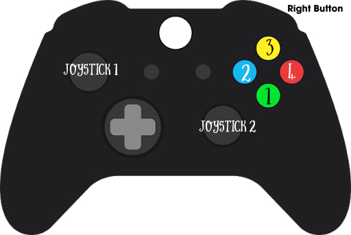

Trò chơi Become a witch in another world có hỗ trợ chơi bằng tay cầm hoặc bàn phím. Lưu ý: việc hỗ trợ chỉ có: chức năng di chuyển, xoay camera và dùng phép. Còn lại các tương tác với giao diện vẫn phải sử dụng cảm ứng.
### Bàn phím
Khi bạn kết nối bàn phím với thiết bị của mình, bạn có thể điều khiển nhân vật của mình như sau:

_Các phím dùng để điều khiển nhân vật trong become a witch in another world_
Trong đó:  
**\- W, A, S, D** và **các phím mũi tên điều hướng:** dùng để di chuyển nhân vật.  
**\- N:** sử dụng chiêu 1. 
**\- J:** sử dụng chiêu 2. 
**\- I:** sử dụng chiêu 3. 
**\- O:** sử dụng chiêu 4. 
**\- K:** sử dụng chiêu đánh thường  
**\- phím <** và **\> :** xoay camera.  
_Lưu ý: bạn có thể giữ phím để dùng chiêu mà không phải nháy nhiều lần._
### Gamepad
Khi bạn kết nối tay cầm Xbox hoặc PS (hoặc các loại tay cầm khác có thể hỗ trợ...), bạn có thể điều khiển nhân vật của mình như sau:

Trong đó:  
**\- Joystick 1:** di chuyển nhân vật theo các hướng.  
**\- Joystick 2:** xoay camera.  
**\- 1, 2, 3, 4:** tương ứng với sử dụng các chiêu 1, 2, 3, 4. 
**\- Phím phụ phải 1 (R1):** sử dụng chiêu đánh thường.
