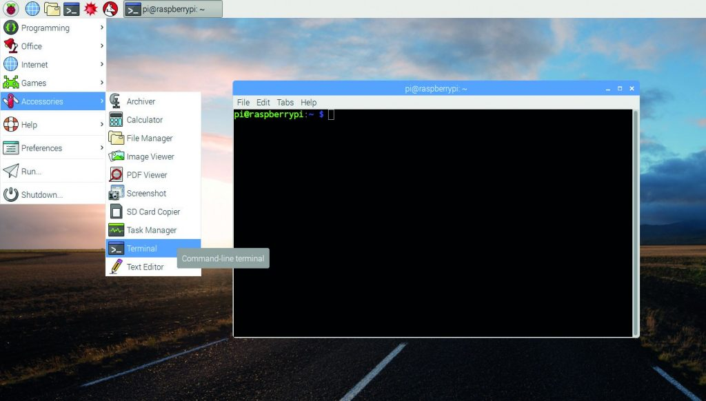

Nếu đang sở hữu một máy tính raspberry có cài hệ điều hành Raspbian. Hẳn sẽ có lúc bạn cần tìm các lệnh cơ bản của Raspbian để phục vụ dự án của mình. Đây là bài viết giúp bạn tìm thấy được những câu lệnh cơ bản hay đươc sử dụng.
<!--more-->
 Hệ điều hành Raspbian
**1\. Các lệnh cơ bản của Raspbian**
- **Cập nhật phiên bản Raspbian**
_apt-get update_
- **Nâng cấp toàn bộ các gói phần mềm đã cài đặt trên Raspbian.**
_apt-get upgrade_
- **Xóa màn hình terminal và các lệnh bạn đã thực thi trước đó. Lưu ý, nó chỉ xóa màn hình đi cho gọn, sạch mà thôi.**
_clear_
- **Xem danh sách ổ đĩa gồm đường dẫn và nhãn bằng lệnh:**
sudo blkid
- **Gỡ ổ đĩa bằng lệnh:**
sudo umount -a
_Lưu ý: -a là gỡ hết_
- **Mount ổ đĩa bằng lệnh:**
sudo mount /dev/sha1 /media/pi/
_Lưu ý: /dev/sha1 là đường dẫn của ổ đĩa, xem bằng lênh ở mục 1._
_/media/pi là đường dẫn ổ được mount vào đó._
- **Khởi động lại**
sudo reboot
- **Tắt máy ngay lập tức**
sudo shudown -h now
- **Tắt máy vào lúc nào đó (ví du: 01:22 AM)**
sudo shutdown -h 01:22
**2\. Các câu lệnh cơ bản của Raspbian về file, folder**
- **mở file bằng trình biên tập text Nano**
sudo nano example.txt
- **xem nội dung file**
sudo cat example.txt
- **chuyển đến thư mục nào đó**
cd /abc/xyz
- **copy file hoặc thư mục**
cp /abc/xyz/example.txt /def/ghy
- **hiển thị danh sách các file trong folder**
ls -la
- **tạo thư mục xyz**
mkdir /abc/xyz
- **di chuyển file sang 1 thư mục khác**
mv
- **xóa file**
rm
- **xóa thư mục**
rmdir
**3\. Các lệnh cơ bản của raspbian liên quan đến mạng**
- **Kiểm tra tình trạng mạng hiện tại trên Raspberry Pi. Bạn có thể biết IP của Raspberry Pi nếu đang kết nối.**
_ifconfig_
- **Kiểm tra adapter không dây nào đang chạy.**
_iwconfig_
- **Hiển thị danh sách các mạng wifi trong khu vực.**
_iwlist wlan0 scan_
- **Hiển thị danh sách các mạng wifi trong khu vực có tên theo yêu cầu.**
_iwlist wlan0 scan | grep ESSID_
- **Quét mạng và hiển thị các thiết bị đang kết nối, cổng, giao thức, trạng thái của hệ thống, địa chỉ MAC và các thông tin khác.**
_nmap_
- **Kiểm tra kết nối giữa các thiết bị trong mạng.**
_ping_
- **Tải file example.txt từ trên mạng về và lưu vào folder hiện tại.**
_wget http://www.website.com/example.txt_
**Tham khảo thêm các câu lệnh khác tại:** [htt](https://www.raspberrypi.org/documentation/linux/usage/commands.md)[ps://www.raspberrypi.org/documentation/linux/usage/commands.md](https://www.raspberrypi.org/documentation/linux/usage/commands.md)
