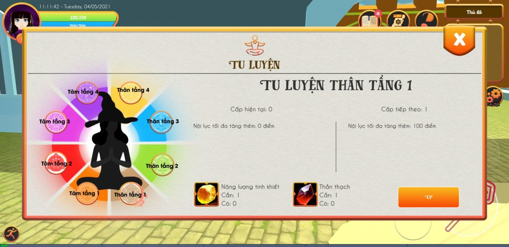

Trong Become a witch in another world, để nhân vật của bạn trở lên mạnh mẽ, ngoài việc luyện cấp, chế tạo trang bị thì một việc cũng quan trọng không kém đó là tu luyện. Việc tu luyện sẽ giúp tăng sức mạnh của nhân vật một cách rõ rệt.

_Bảng tu luyện trong Become a witch in another world_
Như hình trên, các bạn có thể thấy nửa bên phải là tu luyện thân và nửa bên trái là tu luyện tâm. Mỗi bên tu luyện có 4 tầng, trong đó:  
\- tu luyện thân thì tăng cường công nên cần sử dụng thần thạch công để luyện.  
\- tu luyện tâm thì tăng phòng thủ nên cần sử dụng thần thạch thủ để luyện.
### Làm thế nào để có Năng lượng tinh khiết là 2 loại Thần Thạch
Có nhiều cách để bạn kiếm năng lượng tinh kiết và thần thạch, các cách đó là:  
1 - khai thác khoáng sản tại nhà ở trong rừng.  
2 - mua bán tại NPC đá quý.  
3 - đánh quái trong các hang động  
4 - đánh boss.  
5 - mở rương.
### Cách tăng điểm các tầng
Để luyện ở các tầng cao hơn thì các tầng bên dưới bạn phải đủ cấp. Cụ thể là:  
\- Tầng 1 đạt cấp 5 thì mở tầng 2. 
\- Tầng 2 đạt cấp 10 thì mở tầng 3. 
\- Tầng 3 đạt cấp 15 thì mở tầng 4.
### Chi tiết các tầng tu luyện thân
**Tầng 1**  
\- từ cấp 1 - 4: mỗi cấp tăng thêm 100 điểm nội lực.  
\- từ cấp 5 - 9: mỗi cấp tăng thêm 100 điểm nội lực, giảm mana tiêu hao khi dùng phép 5%.  
\- từ cấp 10 trở đi: mỗi cấp tăng thêm 100 điểm nội lực, giảm mana tiêu hao khi dùng phép 5% và 1% nội lực tối đa.
**Tầng 2**  
\- từ cấp 1 - 4: mỗi cấp tăng thêm 100 điểm sát thương cơ bản.  
\- từ cấp 5 - 9: mỗi cấp tăng thêm 100 điểm sát thương cơ bản và 1% sát thương cơ bản hiện có.  
\- từ cấp 10 trở đi: mỗi cấp tăng thêm 100 điểm sát thương cơ bản, 1% sát thương cơ bản hiện có, tất cả công phép tăng 1%.
**Tầng 3**  
\- từ cấp 1 - 4: mỗi cấp tăng thêm 1% chí mạng.  
\- từ cấp 5 - 9: mỗi cấp tăng thêm 1% chí mạng, 1% tỉ lệ chí mạng.  
\- từ cấp 10 trở đi: mỗi cấp tăng thêm 1% chí mạng, 1% tỉ lệ chí mạng, 1% chí mạng và tỉ lệ chí mạng.
**Tầng 4**  
\- từ cấp 1 - 4: mỗi cấp tăng thêm 5 điểm sức mạnh, 5 điểm nhanh nhẹn, 5 điểm trí lực.  
\- từ cấp 5 trở đi: mỗi cấp tăng thêm 5 điểm sức mạnh, 5 điểm nhanh nhẹn, 5 điểm trí lực, 1% may mắn.  
### Chi tiết các tầng tu luyện tâm
**Tầng 1**  
\- từ cấp 1 - 4: mỗi cấp tăng thêm 100 điểm sinh lực.  
\- từ cấp 5 - 9: mỗi cấp tăng thêm 100 điểm sinh lực, 5 máu và 10 mana hồi phục mỗi giây.  
\- từ cấp 10 trở đi: mỗi cấp tăng thêm 100 điểm sinh lực; 5 điểm máu, 10 mana hồi phục mỗi giây và 1% sinh lực tối đa.
**Tầng 2**  
\- từ cấp 1 - 4: mỗi cấp tăng thêm 100 điểm phòng thủ cơ bản.  
\- từ cấp 5 - 9: mỗi cấp tăng thêm 100 điểm phòng thủ cơ bản và 1% phòng thủ cơ bản hiện có.  
\- từ cấp 10 trở đi: mỗi cấp tăng thêm 100 điểm phòng thủ cơ bản, 1% phòng thủ cơ bản hiện có, tất cả thủ phép tăng 1%.
**Tầng 3**  
\- từ cấp 1 - 4: mỗi cấp tăng thêm 0,5 điểm tốc độ di chuyển.  
\- từ cấp 5 - 9: mỗi cấp tăng thêm 0,5 điểm tốc độ di chuyển, 1% né tránh.  
\- từ cấp 10 trở đi: mỗi cấp tăng thêm 1 điểm tốc độ di chuyển, 2% né tránh.
**Tầng 4**  
\- từ cấp 1 - 4: mỗi cấp tăng thêm 1% kinh nghiệm nhận được.  
\- từ cấp 5 trở đi: mỗi cấp tăng thêm 1% kinh nghiệm nhận được, 1% may mắn.
