**Chomper**

Vị trí xuất hiện: Bìa rừng bóng tối  
Máu: 1.500  
Tấn công: 50  
Phòng thủ: 40  
Gil: 2.000  
EXP: 14.686

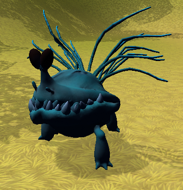

**Spitter**

Vị trí xuất hiện: Bìa rừng bóng tối  
Máu: 3.000  
Tấn công: 55  
Phòng thủ: 50  
Gil: 4.000  
EXP: 62.693

**Turtle**

Vị trí xuất hiện: Ngã ba thủ đô  
Máu: 1.500  
Tấn công: 40  
Phòng thủ: 35  
Gil: 2.000  
EXP: 13.686

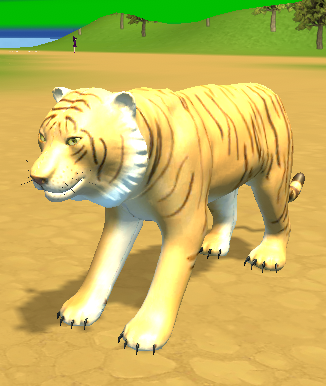

**Tiger**

Vị trí xuất hiện: Ngã ba Oriana  
Máu: 6.000  
Tấn công: 70  
Phòng thủ: 100  
Gil: 6.000  
EXP: 166.918

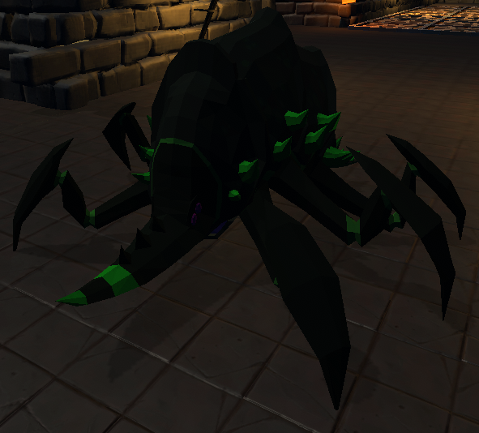

**Metalon**

Vị trí xuất hiện: Hầm ngục Gaap (Gaap Dungeon)  
Máu: 15.000  
Tấn công: 300  
Phòng thủ: 200  
Gil: 8.000  
EXP: 402.557

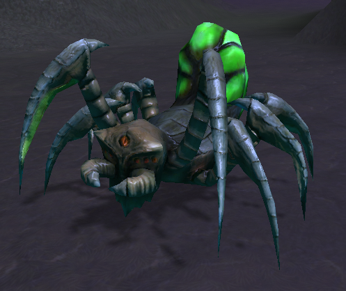

**Spider**

Vị trí xuất hiện: Ngã tư Jocasta  
Máu: 10.000  
Tấn công: 100  
Phòng thủ: 200  
Gil: 10.000  
EXP: 508.107

**Bommer**

Vị trí xuất hiện: Mê cung  
Máu: - 
Tấn công: 100  
Phòng thủ: 90  
Gil: 10.000  
EXP: 508.107

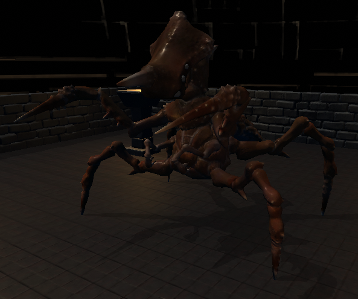

**Gaap (Boss)**

Vị trí xuất hiện: Hầm ngục Gaap (Gaap Dungeon)  
Máu: 30.000  
Tấn công: 500  
Phòng thủ: 400  
Gil: 100.000  
EXP: 3.776.585

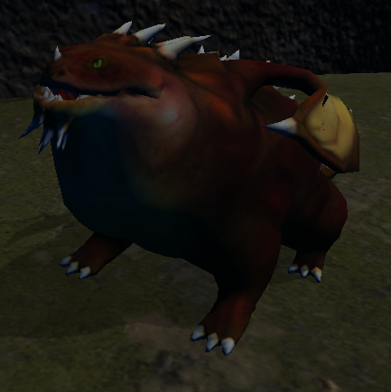

**Dragon Soul**

Vị trí xuất hiện: Hang Dogu  
Máu: 40.000  
Tấn công: 500  
Phòng thủ: 400  
Gil: 12.000  
EXP: 2.200.018

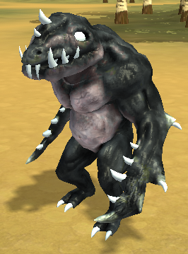

**Horridus**

Vị trí xuất hiện: đường tây  
Máu: 40.000  
Tấn công: 150  
Phòng thủ: 300  
Gil: 14.000  
EXP: 1.256.414

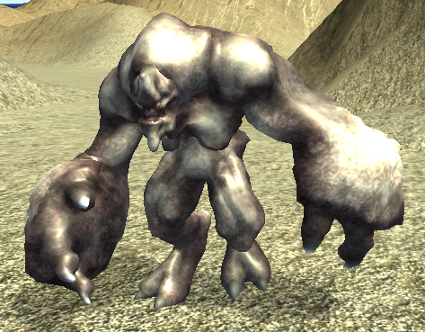

**Titan**

Vị trí xuất hiện: ngã ba Rosand  
Máu: 60.000  
Tấn công: 200  
Phòng thủ: 400  
Gil: 16.000  
EXP: 1.554.535

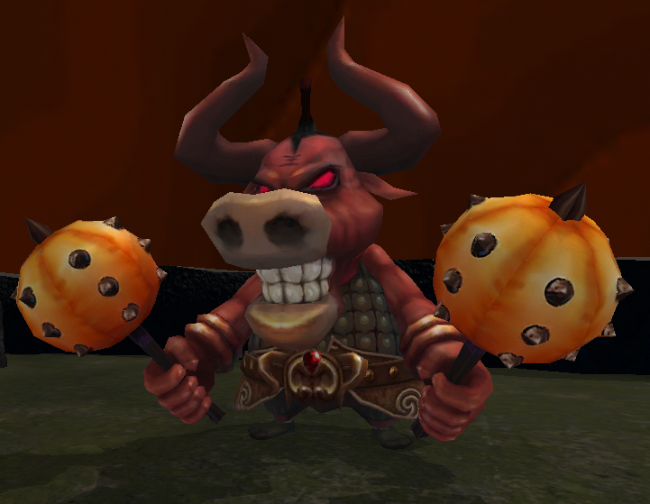

**Minotaur (Boss)**

Vị trí xuất hiện: Hang Dogu  
Máu: 80.000  
Tấn công: 700  
Phòng thủ: 600  
Gil: 200.000  
EXP: 9.421.885

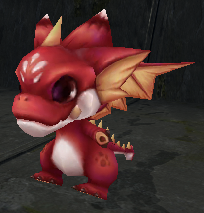

**Little Dragon**

Vị trí xuất hiện: Mê cung rồng  
Máu: 80.000  
Tấn công: 500  
Phòng thủ: 600  
Gil: 50.000  
EXP: 1.796.738

**Quỷ biển Shapeshifter (Boss)**

Vị trí xuất hiện: Cảng tây  
Máu: 160.000  
Tấn công: 900  
Phòng thủ: 800  
Gil: 300.000  
EXP: 13.195.940

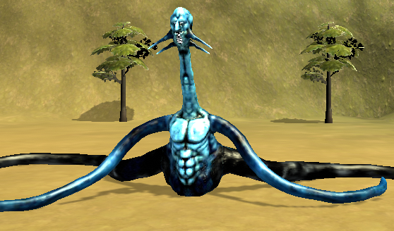

**Mutant**

Vị trí xuất hiện: đường Lime  
Máu: 80.000  
Tấn công: 300  
Phòng thủ: 700  
Gil: 18.000  
EXP: 2.042.779

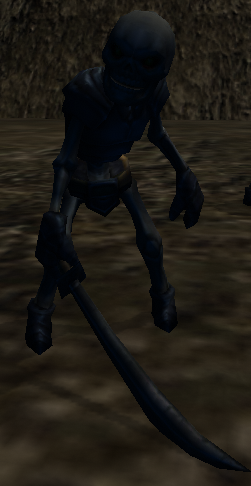

**Skeleton**

Vị trí xuất hiện: hang Rosand  
Máu: 160.000  
Tấn công: 200  
Phòng thủ: 800  
Gil: 20.000  
EXP: 2.271.526

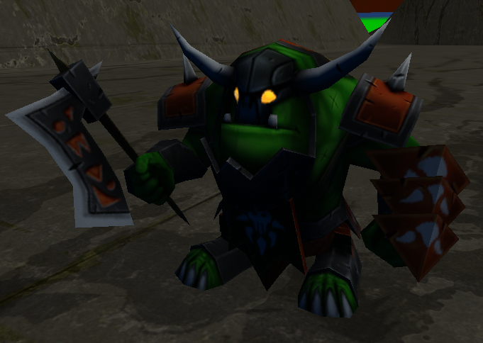

**Ogre**

Vị trí xuất hiện: Ngục Dogu (Dogu Dungeon)  
Máu: 200.000  
Tấn công: 300  
Phòng thủ: 900  
Gil: 30.000  
EXP: 2.505.798

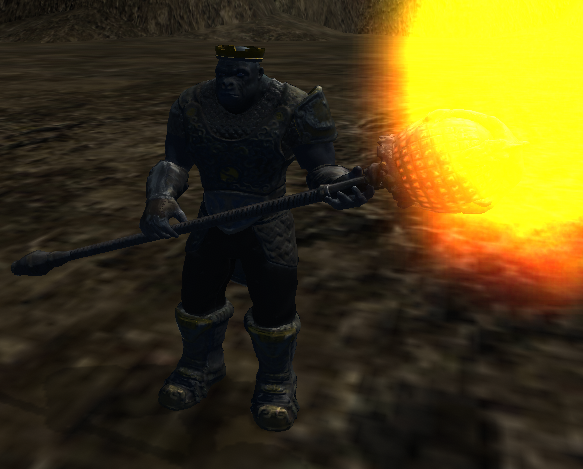

**Vua của Rosand (Boss)**

Vị trí xuất hiện: hang Rosand  
Máu: 400.000  
Tấn công: 1.500  
Phòng thủ: 1.500  
Gil: 400.000  
EXP: 22.647.010

**Quỷ Eirlys**

Vị trí xuất hiện: hang mới (tàn tích Eirlys)  
Máu: 300.000  
Tấn công: 1.000  
Phòng thủ: 1.000  
Gil: 50.000  
EXP: 14.517.837

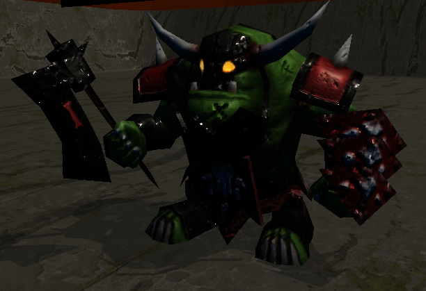

**Chúa tể Ogre (Boss)**

Vị trí xuất hiện: ngục Dogu (Dogu Dungeon)  
Máu: 600.000  
Tấn công: 2.500  
Phòng thủ: 2.000  
Gil: 500.000  
EXP: 22.659.196

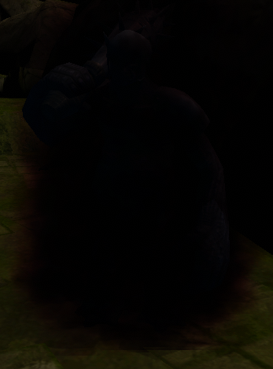

**Vua của Eirlys (Boss)**

Vị trí xuất hiện: hang mới (tàn tích Eirlys)  
Máu: 1.000.000  
Tấn công: 3.500  
Phòng thủ: 3.000  
Gil: 600.000  
EXP: 25.120.280

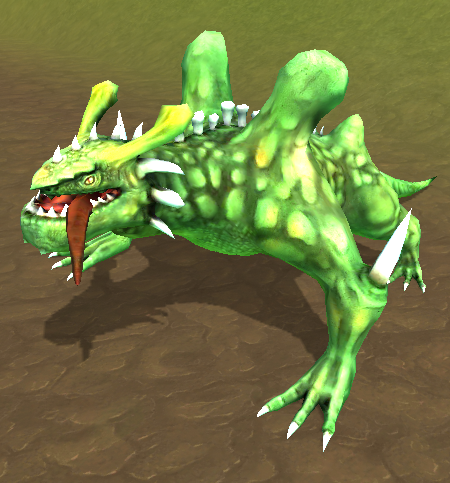

**Nightmare Dragon**

Vị trí xuất hiện: đường lên núi rồng  
Máu: 600.000  
Tấn công: 1.000  
Phòng thủ: 2.000  
Gil: 60.000  
EXP: 30.423.028

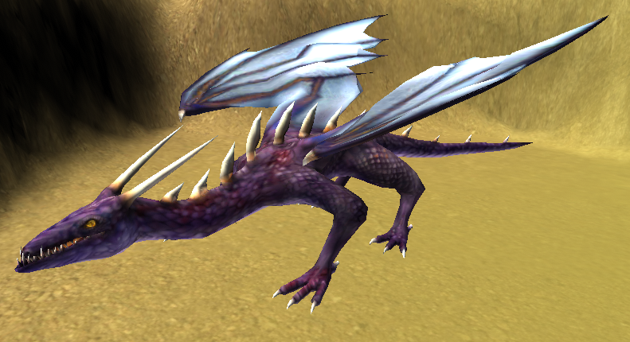

**Usurper Dragon (Boss)**

Vị trí xuất hiện: núi rồng  
Máu: 4.000.000  
Tấn công: 6.000  
Phòng thủ: 5.000  
Gil: 2.000.000  
EXP: 58.393.274

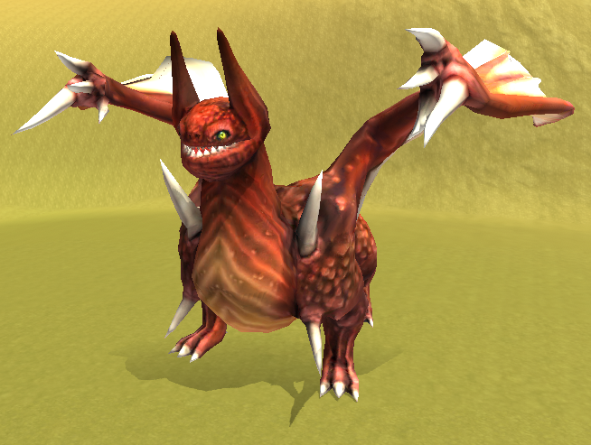

**Terror Bringer Dragon (Boss)**

Vị trí xuất hiện: núi rồng  
Máu: 6.000.000  
Tấn công: 8.000  
Phòng thủ: 6.000  
Gil: 3.000.000  
EXP: 72.130.400
