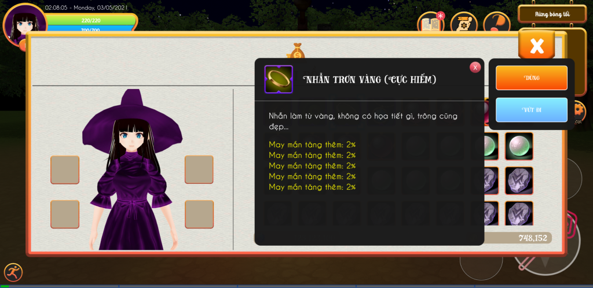

Become a witch in another world có chức năng chế tạo trang bị, giúp bạn sở hữu những trang bị mạnh mẽ theo ý muốn của mình.

_Một trang bị được chế tạo_ trong Become a witch in another world
Để chế tạo được trang bị, bạn cần sử hữu một trang bị rỗng (không có dòng) sau đó bạn tới cái vạc để tiến hành đục lỗ trang bị này và khảm thuộc tính vào. Cách thực hiện lần lượt như sau:
**1 -** Bạn sử dụng một trang bị bất kỳ mà bạn thích, sau đó tới các vạc và chọn xóa thuộc tính trang bị. (Xem bài: [Hướng dẫn xóa thuộc tính của trang bị](https://expvn.com/huong-dan-xoa-toan-bo-thuoc-tinh-dong-cua-trang-bi/)).  
**2 -** Sau khi xóa thuộc tính xong, bạn có thể đục lỗ trang bị. Bạn lưu ý, phẩm chất trang bị càng cao thì trang bị đó càng đục được nhiều lỗ. Cụ thể như sau:  
\- Trang bị trắng: 2 lỗ.  
\- Trang bị xanh: 3 lỗ.  
\- Trang bị tím: 5 lỗ.  
\- Trang bị vàng: 6 lỗ.  
\- Trang bị đỏ: 7 lỗ.  
**3 -** Sau khi trang bị được đục lỗ xong, nó sẽ xuất hiện ở phần khảm thuộc tính cho trang bị. Lúc này bạn có thể chọn đá thuộc tính và khảm vào trang bị. (Xem bài: [đục lỗ và khảm thuộc tính cho trang bị](https://expvn.com/huong-dan-duc-lo-va-kham-thuoc-tinh-vao-trang-bi/)).
### Đá thuộc tính
Mỗi viên đá thuộc tính chỉ chứa duy nhất 1 thuộc tính. Bạn có thể tìm thấy đá thuộc tính ở:  
\- khu khai thác (nhà của Shino ở trong rừng bóng tối).  
\- mở rương.  
\- đánh quái trong các hầm ngục, hang động, boss...  
\- mua ở cửa hàng đá quý.  
\- hút thuộc tính từ các trang bị không sử dụng. (Xem bài: [Hướng dẫn hút thuộc tính của trang bị](https://expvn.com/huong-dan-hut-tach-thuoc-tinh-tu-trang-bi/)).
