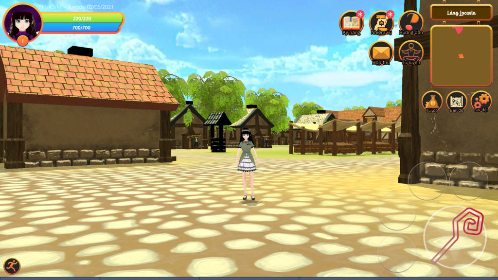

Become a witch in another world - trở thành phù thủy ở thế giới khác. Với thế giới mở và cốt truyện nhẹ nhàng, chắc chắn sẽ đem đến cho bạn khoảng thời gian vui vẻ và thư giãn.

Một cảnh trong trò chơi Become a witch in another world
### Mở đầu trò chơi
Nhân vật chính là Shino, một nữ sinh vô tình bị hút vào một vết nứt không gian và được đưa tới một thế giới khác. Bối cảnh của thế giới đó tương đương với thời trung cổ ở thế giới cũ của cô. Tại đây, cô gặp gỡ, giúp đỡ nhiều người và dần hiểu về thế giới mới.
### Các tính năng nổi bật trong trò chơi
\- Luyện cấp: cấp nhân vật là không giới hạn, bạn càng lên cao, nhân vật của bạn càng mạnh.  
\- Thu thập trang bị: bạn cần thu thập, lựa chọn hoặc chế tạo đồ để nhân vật của bạn ngày càng mạnh mẽ. (Xem bài: [Giới thiệu về cách chế tạo đồ](https://expvn.com/gioi-thieu-tinh-nang-che-tao-trang-bi/))  
\- Bảng tu luyện nâng sức mạnh bản thân.  
\- Bản đồ thế giới rộng và mở.  
\- Khả năng dịch chuyển đến bất cứ đâu (Xem bài: [Hướng dẫn sử dụng bản đồ để di chuyển](https://expvn.com/huong-dan-cach-su-dung-ban-do-de-di-chuyen/))  
\- Nhiều Boss khủng (Xem bài: [Giới thiệu các loại quái vật](https://expvn.com/gioi-thieu-cac-loai-quai-trong-become-a-witch-in-another-world/))  
\- Nhân vật dễ thương.  
\- Thời trang đa dạng.  
\- Hỗ trợ bàn phím và gamepad. (Xem bài: [hướng dẫn sử dụng bàn phím và gamepad](https://expvn.com/become-a-witch-in-another-world-ho-tro-ban-phim-va-tay-cam/))  
Và còn rất nhiều điều đang chờ bạn khám phá...

https://www.youtube.com/watch?v=3t769tT0ZUQ&t=1s

Giới thiệu trò chơi Become a witch in another world
### NPC mua bán trong trò chơi
Các NPC mua bán trong trò chơi sẽ tùy thuộc vào nơi vị trí của NPC đó ở mà định giá. Ví dụ cùng một vật phẩm nhưng NPC ở các thành sẽ bán các vật phẩm đắt hơn NPC ở các làng. Có những vật phẩm chỉ được bán ở làng hoặc thành nhất định. Ngoài ra, có một số NPC sẽ giảm giá cho bạn sau khi bạn thực hiện thành công nhiệm vụ.
### NPC Thần bí thương nhân
Đúng như tên gọi, thần bí thương nhân di chuyển khắp nơi trên thế giới để sưu tập những vật phẩm quý hiếm. Nếu may mắn gặp anh ta, bạn nhớ lại gần và xem hàng hóa mà anh ta bán, chắc chắn sẽ toàn là hàng hiếm thôi đó.
### Mục tiêu của trò chơi
Như các thể loại RPG khác, Become a witch in another world cũng có kết cục. Tuy nhiên, bạn hoàn toàn có thể không quan tâm tới kết cục của trò chơi. Thay vào đó, bạn có thể tự do luyện cấp, tìm kiếm và chế tạo trang bị, sưu tập thời trang... và thử sức với những quái vật hùng mạnh nhất trong trò chơi. Nếu bạn chọn chỉ đi tới kết cục của trò chơi, có thể bạn sẽ bỏ lỡ rất rất nhiều điểm hay...
### Hoàn thành trò chơi
Trò chơi có một kết cục nhưng có 3 cách để bạn có thể đi tới kết cục đó. Tùy vào bạn lựa chọn mà câu truyện sẽ khác nhau. Ngoài ra, nếu bạn có sức mạnh để hạ hết tất cả các quái vật thì cũng có thể tính là bạn đã hoàn thành trò chơi.
### Tải trò chơi (Android)
[Google Play](https://play.google.com/store/apps/details?id=com.EXPGames.Becomeawitchinanotherworld)
