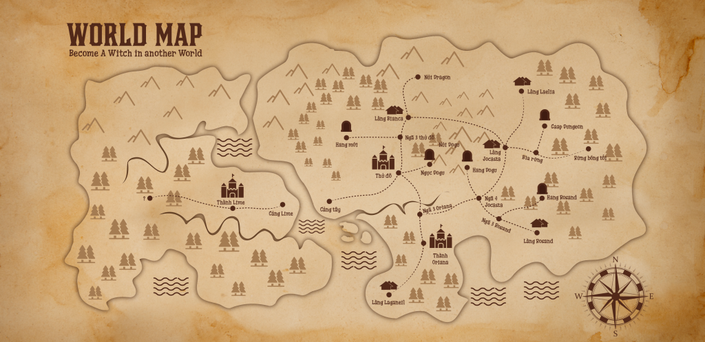
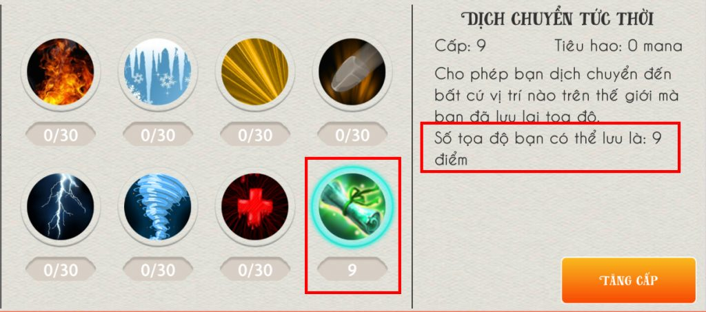

Thế giới bên trong become a witch in another world không quá lớn nhưng việc di chuyển qua lại các nơi cũng sẽ tiêu tốn của bạn khá nhiều thời gian. Vì vậy, bạn đừng bỏ qua phép dịch chuyển tức thời vì nó có thể dịch chuyển bạn đến bất cứ đâu ngay lập tức, miễn là nơi đó bạn đã từng tới và đã lưu vị trí dịch chuyển.

Bản đồ thế giới trong become a witch in another world
Trước tiên, để lưu vị trí dịch chuyển thì bạn cần học phép dịch chuyển tức thời ở bảng kỹ năng. Mỗi cấp của phép tương ứng với một điểm dịch chuyển.

_Phép dịch chuyển tức thời trong become a witch in another world._
Như hình bên trên bạn có thể thấy, phép dịch chuyển tức thời là 9, và số tọa độ có thể lưu là 9 điểm.
Bây giờ, bạn hãy tới vị trí muốn quay lại lần tới, mở bản đồ lên và bấm vào nút "Thêm vị trí".
Khi muốn xóa bỏ vị trí đã lưu, bạn bấm vào nút "Xóa vị trí", khi "Xóa vị trí" chuyển sang màu xanh, bạn bấm chọn vị trí muốn xóa bỏ thì lập tức vị trí đã lưu sẽ biến mất.
Bạn có thể xem chi tiết cách thực hiện ở video dưới đây:
https://youtu.be/EczLUw6QEjQ
