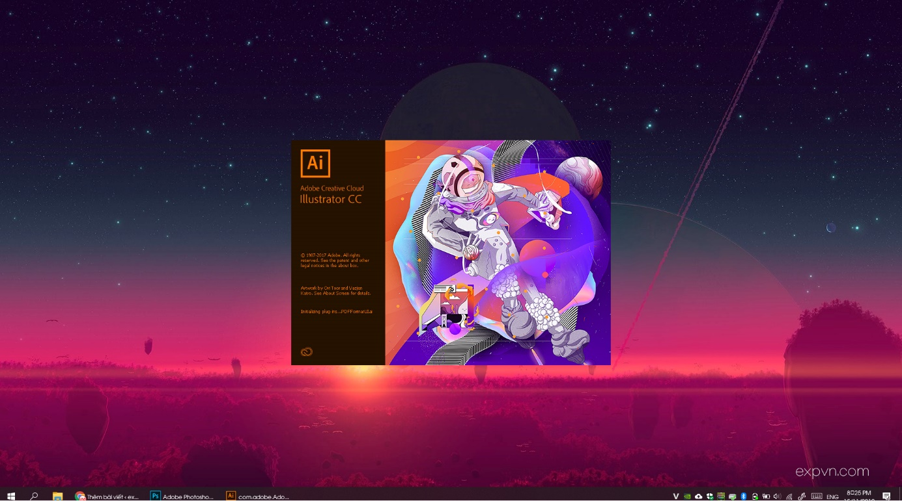
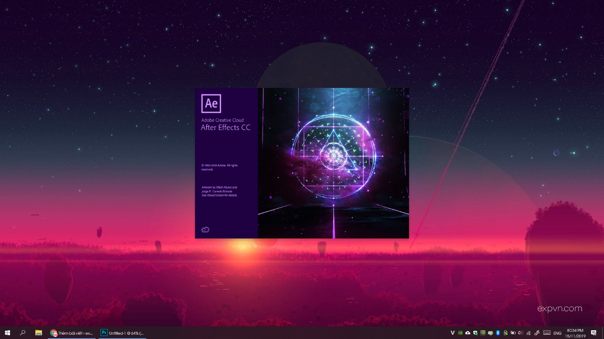
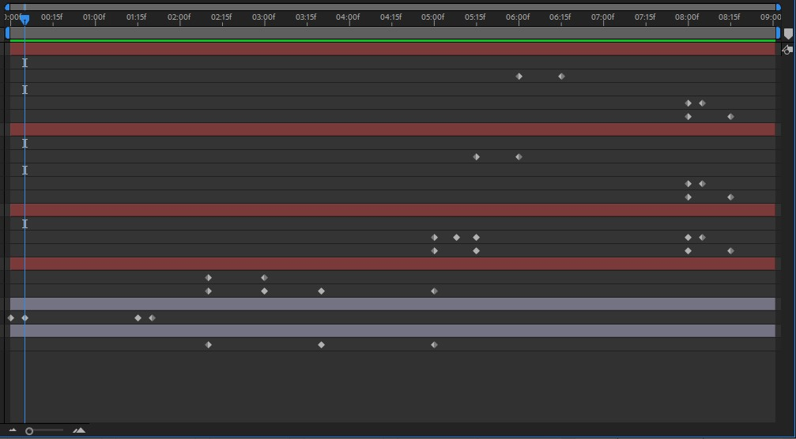
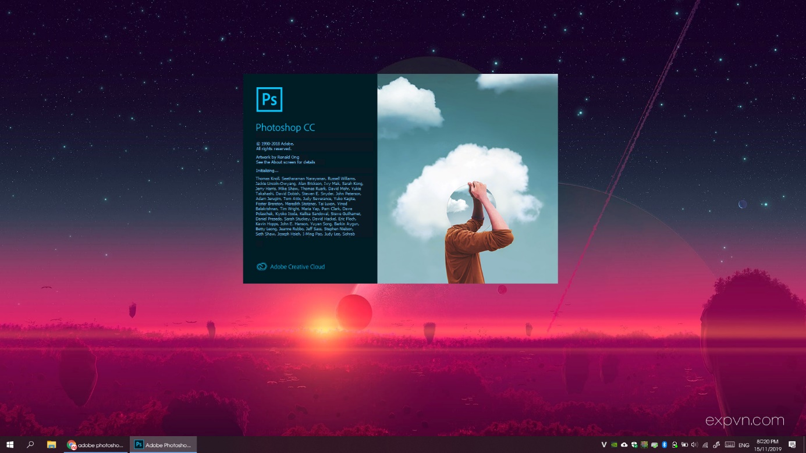
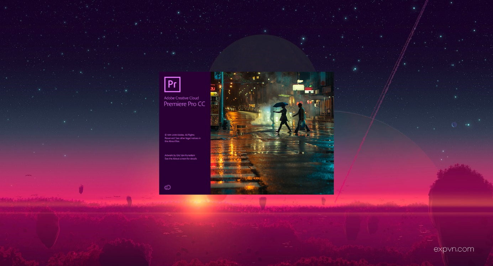
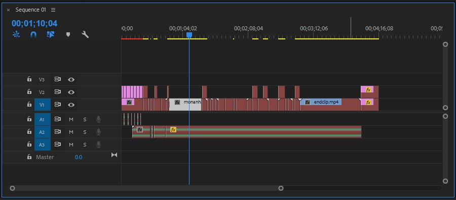

Nên học phần mềm nào của Adobe?
Câu hỏi này thường đến với những người bắt đầu tìm hiểu về con đường thiết kế. Thậm chí, một số người đã học xong, hay làm được 1 vài sản phẩm rồi, đôi khi vẫn tự hỏi mình nên chọn phần mềm nào để làm…
<!--more-->
Để trả lời câu hỏi: tôi nên học phần mềm nào. Trước tiên, bạn cần tìm hiểu xem chức năng của mỗi phần mềm là gì, nó chuyên về gì. Sau khi hiểu rõ chức năng của phần mềm và phần tích công việc của bạn. Bạn sẽ có lựa chọn chính xác cho mình.
Bài viết này nhằm giúp các bạn giải quyết câu hỏi: Nên học phần mềm nào của Adobe.
**Chức năng chính trong một số phần mềm của hãng Adobe**
 Adobe Photoshop CC
**1 – Adobe Photoshop – Chỉnh sửa ảnh**
Photoshop dần trở thành 1 phần mềm cơ bản mà gần như ai cũng cần phải biết. Có muôn vàn lý do để bạn cần phải biết Photoshop như:
- Để chỉnh ảnh cho bản thân, gia đình, bạn bè…
- Để thiết kế website.
- Để làm quảng cáo online.
- Vì thấy thích thì học thôi…
Và khi bạn truy cập internet sẽ thấy nhiều lời nhắc về Photoshop. Chủ yếu cộng đồng mạng nhắc về Photoshop là về chế ảnh, là xóa ai đó ra khỏi bức ảnh, là chỉnh giúp cho đẹp lên, ghép thêm gì đó vào ảnh… Cũng như vậy, khi nhìn thấy bức ảnh nào đó hơi phi lý một chút thì đa phần sẽ đều quy chụp rằng: Photoshop.
**Photoshop xử lý ảnh như thế nào?**
Photoshop thực ra là một phần mềm chuyên để sửa ảnh bằng cách điều chỉnh các pixel. Có thể gọi là đồ họa Raster hoặc bitmap. Chính vì điều này, những bức ảnh đưa vào Photoshop để xử lý cần có độ phân giải cao. Ví dụ cơ bản:
- Một bức ảnh có độ phân giải là 1280 x 720 (tức HD). Có nghĩa là có 1280 điểm ảnh xếp theo chiều ngang và 720 điểm ảnh xếp theo chiều dọc.
- Bức ảnh khác có độ phân giải là 1920 x 1080 (tức FullHD). Có nghĩa là có 1920 điểm ảnh xếp theo chiều ngang và 1080 điểm ảnh xếp theo chiều dọc.
Nhìn thông số trên bạn cũng có thể thấy rằng, trên cùng một kích thước màn hình. Nếu bạn copy cả hai bức ảnh này vào cùng một thiết bị. Bạn sẽ nhận ra bức ảnh FullHD sẽ nét hơn bức ảnh HD. Lý do là, cùng một kích thước màn hình và cùng xem ở chế độ toàn màn hình. Số điểm ảnh của bức ảnh FullHD nhiều hơn nên các điểm ảnh cũng nhỏ hơn. Ngược lại, bức ảnh HD sẽ phải phóng to các điểm ảnh ra để bức hình có thể phủ toàn màn hình.
Cũng chính vì điều này, để chỉnh sửa trên photoshop thì trước tiên bạn cần một bức hình có chất lượng tốt. Lúc này, việc chỉnh sửa sẽ dễ dàng hơn và cho ra kết quả tốt.
**Photoshop có thể làm được những gì?**
Việc chỉnh sửa màu sắc, vị trí các pixel, điều này không khác gì bạn vẽ một bức tranh. Vì vậy, khả năng của Photoshop đa số bị giới hạn bởi kỹ năng của bạn. Tất nhiên, cũng có phần bị giới hạn bởi công cụ làm việc…
Với Photoshop, bạn có thể:
- Chèn chữ vào ảnh.
- Xóa các chi tiết thừa, không mong muốn trên bức ảnh.
- Tách nền, ghép thêm người, vật vào ảnh.
- Xóa mụn, chỉnh da, bóp nhỏ hay phóng to 1 phần của cơ thể, chỉnh màu ảnh.
- Thiết kế tờ rơi, quảng cáo.
- Sáng tạo ra một bức ảnh hoàn toàn mớ.
- Dùng bảng vẽ để vẽ trên Photoshop
- … và nhiều nhiều những thứ hay ho khác bạn có thể làm bằng Photoshop.
Đọc đến đây, có lẽ sẽ có bạn nghĩ rằng: vậy thì mình học Photoshop thôi là đủ rồi. Nhưng bạn hãy khoan kết luận vội. Photoshop có nhiều đường đi, nhưng chưa chắc tất cả đều dễ đi. Hãy tiếp tục tìm hiểu thêm để có quyết định chính xác nhất: Nên học phần mềm nào của Adobe.
 Adobe Illustrator CC
**2 – Adobe Illustrator – Vẽ vector**
Khác với Photoshop, Illustrator chủ yếu xử lý hình ảnh vector. Các công cụ vẽ của Illustrator sẽ tạo ra các đối tượng vector. Vậy đối tượng vector là thế nào?
Như chúng ta đã biết, “hai điểm trong không gian tạo ra một đoạn thẳng”. Illustrator sử dụng các điểm nút và dùng thuật toán để nối các điểm nút này với nhau. Các nút này được gọi là Point còn đường nối các nút với nhau gọi là Path. Chính vì xử lý bằng thuật toán, nên hình vẽ được vẽ trong Illustrator sẽ không bị vỡ hình. Bạn có phóng to đối tượng lên 1000 lần thì nó vẫn sắc nét.
Chính vì Illustrator tập trung vào việc vẽ vector mà không phải là chỉnh sửa ảnh nên nó không phổ thông như Photoshop. Ngoài điểm mạnh là tạo ra đối tượng vector, thì Illustrator với thao tác đơn giản sẽ khiến việc bạn vẽ và hoàn thành công việc rất nhanh chóng. Mình quen nhiều người, sau khi biết dùng Illustrator đều quyết định sử dụng phần mềm này để vẽ thiết kế thay vì Photoshop.
**Những ai nên sử dụng Illustrator?**
Bạn sẽ phải học và làm việc với Illustrator nếu như công việc của bạn yêu cầu làm những điều sau đây:
- Thiết kế dùng để in ấn. Tờ rơi, thiệp, Poster, Card Visit, tờ gấp, banner, biển hiệu, cắt chữ…
- Thiết kế Banner, Poster dùng cho Marketing online.
- Thiết kế logo, bộ nhận diện thương hiệu.
- Thiết kế website.
- Bạn có thể dàn trang bằng Illustrator. Như vậy, bạn có thể làm sách, báo,… (tuy nhiên, nếu bạn chỉ chuyên dàn trang, bạn nên tìm hiểu InDesgin).
- Vẽ nhân vật hoạt hình.
- …
Những thứ mình liệt kê ở trên, tuy bạn cũng có thể làm bằng Photoshop nhưng đảm bảo nếu bạn dùng Illustrator bạn sẽ thấy công việc trở lên dễ dàng và nhanh chóng hơn rất nhiều.
**Thiết kế bằng Illustrator đơn giản thế nào?**
Illustrator có rất rất nhiều thư viện miễn phí, giúp cho công việc của bạn dễ dàng hơn nữa. Giả sử bạn chuẩn bị thiết kế một bức ảnh quảng cáo trên Facebook mừng sinh nhật công ty. Bạn hãy thử truy cập vào Website dưới đây:
**Freepik:** [https://www.freepik.com/home](https://www.freepik.com/home)
sau đó, hãy gõ “party” hoặc “birthday”. Bạn sẽ thấy rất nhiều hình ảnh liên quan đến từ khóa này. Điều quan trọng ở đây là đa số những hình ảnh bạn tìm kiếm được đều miễn phí. Hình tải về bạn có thể chỉnh sửa hoàn toàn bằng Illustrator. Chỉnh sửa ở đây là, bạn lấy quả bóng từ hình này, bánh sinh nhật từ hình kia, nền lại ở một hình khác… sau đó xào xáo thành một tác phẩm mới. Với điều này, những người mới cũng có cơ hội tạo ra những tác phẩm đẹp mà không cần có năng khiếu vẽ, cũng không mất quá nhiều thời gian.
**Vậy có còn cần đến Photoshop hay phần mềm khác?**
Từ những điểm mạnh trên, ai làm thiết kế chắc sẽ không cần dùng đến Photoshop? Ngược lại, bạn làm thiết kế bạn càng phải giỏi Photoshop. Ví dụ: khi bạn muốn ghép người mẫu vào trong Poster của mình nhưng người mẫu lại đứng trên một nên không phù hợp. Lúc này bạn buộc phải dùng Photoshop để tách người mẫu khỏi nền rồi mới đưa sang Illustrator. Hoặc việc chỉnh màu sắc cho bức ảnh, chỉnh cho mẫu đẹp hơn… cũng tương tự vậy.
Còn nếu bạn là người thiết kế bao bì, nhãn hiệu để làm thương hiệu sản phẩm. Bạn nên tìm hiểu thêm Adobe Dimension. Khi bạn cần ghép bao bì vào sản phẩm để làm quảng cáo. Bạn lại phải đưa sang Photoshop để ghép hình, nhưng sẽ rất khó cho bạn thực hiện đúng ý tưởng. Lúc này Adobe Dimension sẽ giúp bạn thực hiện công việc 1 cách vô cùng đơn giản và chính xác.
Đến đây, một số bạn có lẽ đã quyết định được nên học phần mềm nào của Adobe. Tuy nhiên, hãy nên đọc tiếp vì biết đâu bạn sẽ tìm thêm được phần mềm hay.
 Photoshop Lightroom Classic CC
**3 – Photoshop Lightroom Classic – Quản lý và chỉnh màu ảnh**
Lightroom Classic CC giống như là được tách ra khỏi Photoshop vậy. Nói đúng hơn là sao chép và cải tiến. Lightroom chuyên cho việc quản lý ảnh, chỉnh màu sắc của bức ảnh.
Việc sử dụng Lightroom rất đơn giản, nó giống như đang sử dụng một phần mềm trên điện thoại vậy. Bạn kéo thanh trượt và hình ảnh thay đổi màu sắc. Ngoài ra, Lightroom có khả năng đồng bộ hiệu ứng mà bạn vừa chỉnh cho hàng loạt ảnh. Thay đổi kích thước, độ phân giải, hay đóng dấu bản quyền hàng loạt ảnh. Điều này rất cần thiết cho các nhiếp ảnh gia. Khi bạn có một buổi chụp hình, những hình ảnh ở cùng một môi trường sáng (thời gian, không gian, địa điểm). Thay vì phải chỉnh từng bức thì bạn chỉ cần chỉnh một tấm rồi đồng bộ hàng loạt là xong.
**Dùng Lightroom có cần dùng Photoshop nữa không?**
Tất nhiên là có, Lightroom chỉ có chức năng chỉnh sửa màu sắc và một vài chức năng cơ bản. Nếu bạn muốn làm mịn da, sửa dáng, là phẳng quần áo, xóa chi tiết thừa… Bạn vẫn cần chỉnh sửa ở Photoshop. Tuy nhiên, Photoshop của nhiếp ảnh gia sẽ khác với photoshop của một người thiết kế đồ họa.
Đến đây, những bạn muốn theo đuổi con đường nhiếp ảnh có lẽ đã trả lời được câu hỏi nên học phần mềm nào của Adobe. Nếu đã đọc đến đây, bạn nên đọc tiếp hai phần mềm dưới. Bởi đôi khi nhiếp ảnh gia cũng muốn làm phim.
 Adobe Premiere CC
**4 – Adobe Premiere – Biên tập video**
Nếu bạn thường xuyên phải biên tập video. Đừng do dự, hãy chọn Premiere. Dù là nghiệp dư hay chuyên nghiệp, Premiere đều đáp ứng rất tốt nhu cầu của các bạn. Với thao tác sử dụng đơn giản, giao diện thân thiện, chỉ cần khoảng 3 tiếng học là bạn đã có thể sử dụng Premiere ở mức độ cơ bản.
**Trong 3 tiếng học Premiere bạn có thể làm được những gì?**
Mình đã bảo rằng Premiere có giao diện thân thiện, dễ dùng. Và với 3 tiếng học bạn chắc chắn có thể:
- Cắt, ghép, sắp xếp thứ tự các clip và xuất chúng thành một video hoàn chỉnh. (Biên tập)
- Chèn chữ, logo vào video.
- Sử dụng, tạo các Key Frame cơ bản. Các key frame cơ bản như: Motion, Opacity, Audio, Mask… Hiểu đơn giản thì với key frame bạn có thể làm chữ chạy, xuất hiện và biến mất…
- Hiểu Blending Mode cơ bản.
- Làm phụ đề.
- Chỉnh màu cơ bản cho video.
- Làm chuyển cảnh với một số hiệu ứng cơ bản.
- Biết một số hiệu ứng cơ bản trong Panel Effects.
Với những kiến thức đó, bạn hoàn toàn có thể tạo ra được những video đẹp, đáp ứng nhiều nhu cầu, mục đích khác nhau.
**Làm Premiere có cần biết thêm phần mềm nào khác không?**
Bạn nên biết Photoshop hoặc Illustrator (tốt nhất là Illustrator). Sử dụng phần mềm đó để tạo chữ, cảnh hoặc các đối tượng đặc biệt. Sau đó đưa các đối tượng này vào Premiere. Ngoài ra, video thì cần có âm thanh. Premiere cũng có thể xử lý âm thanh nhưng để chuyên hơn, bạn nên tìm hiểu thêm Adobe Audition.
Đến đây, các bạn có câu hỏi làm video thì nên học phần mềm nào của Adobe, có lẽ đã đưa ra được cho mình lựa chọn.
 Adobe After Effects CC
**5 – Adobe After Effects – Làm hiệu ứng, chuyển động… trong video**
Cũng có thể chỉnh sửa, biên tập Video như Premiere. After Effects còn có thể làm nhiều hiệu ứng, chuyển động đặc biệt mà Premiere không làm được. Vậy tại sao không dùng After Effects luôn còn làm Premiere làm gì?
Lý do không dùng After Effects chỉ để biên tập video vì công việc chính của After Effects là làm hiệu ứng với hình ảnh. Do vậy, mỗi lần thực hiện After Effects sẽ cần render để tạo video. Nếu máy bạn không đủ mạnh thì việc xem trước video sẽ rất chậm, giật và âm thanh cũng không nghe rõ. Ngoài ra, Premiere biên tập tuần tự theo thời gian còn After Effects biên tập theo Layers nên việc quản lý dòng thời gian khi biên tập của Premiere sẽ đơn giản hơn.
Ví dụ: bạn có 100 clip cần biên tập để tạo thành 1 video. Với Premiere bạn chỉ cần một vài dòng timeline thì với After Effects bạn sẽ cần 100 dòng Layers.
 Timeline của Premiere
Ở trên là một Sequence (các video được sắp xếp tuần tự theo dòng thời gian) của Premiere. Dòng V1 mình để video chạy tuần tự, dòng V2 là các chữ, hình ảnh sẽ chạy ra. A1 là các hiệu ứng chạy ra chạy vào, A2 là nhạc nền video… Dòng thời gian chạy đến đâu thì chỗ đó được hiện ra trên video.
 Timeline của After Effects
Ở trên là dòng thời gian của After Effects. Bạn có thể thấy, với 6 Layer (là các dòng kẻ đỏ, tím) và 1 ít hiệu ứng (là các Key frame) nhưng nhìn trông đã khá rắc rối. Như ở hình trên, các Layer tồn tại từ đầu đến cuối video. Nó được quy định bởi các key frame khi nào xuất hiện, khi nào biến mất…
**Vậy After Effects để làm gì?**
Bạn nên dùng After Effects để làm hiệu ứng, làm video hoạt hình, chuyển động nhân vật… Ví dụ: bạn làm video bạn bước ra từ trong gương. Bạn đang bay. Đĩa bay xuất hiện. Biến hình. Làm video hoạt hình. Chuyển động hoạt hình. Video dạng infographic, intro-outro video…
Với những kiểu video như thế, làm việc với After Effects bằng cách dùng các Layers như trên lại đơn giản và dễ làm việc hơn.
**Dùng After Effects có cần biết thêm phần mềm khác không?**
Có! Với After Effects bạn cần biết Photoshop, Illustrator, Audition. Nếu bạn làm về chuyển động hoạt hình, bạn nên biết thêm Adobe Animate. Khi bạn dùng After Effects rồi, bạn nên sử dụng thêm Media Encoder để xuất video. Lúc này Video được xuất ra sẽ nhẹ hơn bạn xuất trực tiếp từ After Effects rất nhiều.
Như vậy, đến đây mình tin rằng đa số các bạn sẽ trả lời được câu hỏi nên học phần mềm nào của Adobe rồi. Mình tin rằng, bạn cũng hiểu nếu chỉ biết một phần mềm thôi thì vẫn chưa đủ để phục vụ tốt công việc. Hãy trang bị cho mình kiến thức về tất cả những phần mềm có thể phục vụ cho công việc của mình. Có lẽ, bắt đầu từ Photoshop vì nó sẽ đang trở nên phổ thông với cả những người không theo ngành thiết kế.
Nên học phần mềm nào của Adobe?
Câu hỏi này thường đến với những người bắt đầu tìm hiểu về con đường thiết kế. Thậm chí, một số người đã học xong, hay làm được 1 vài sản phẩm rồi, đôi khi vẫn tự hỏi mình nên chọn phần mềm nào để làm…
Để trả lời câu hỏi: tôi nên học phần mềm nào. Trước tiên, bạn cần tìm hiểu xem chức năng của mỗi phần mềm là gì, nó chuyên về gì. Sau khi hiểu rõ chức năng của phần mềm và phần tích công việc của bạn. Bạn sẽ có lựa chọn chính xác cho mình.
Bài viết này nhằm giúp các bạn giải quyết câu hỏi: Nên học phần mềm nào của Adobe.
**Chức năng chính trong một số phần mềm của hãng Adobe**
 Adobe Photoshop CC
**1 – Adobe Photoshop – Chỉnh sửa ảnh**
Photoshop dần trở thành 1 phần mềm cơ bản mà gần như ai cũng cần phải biết. Có muôn vàn lý do để bạn cần phải biết Photoshop như:
- Để chỉnh ảnh cho bản thân, gia đình, bạn bè…
- Để thiết kế website.
- Để làm quảng cáo online.
- Vì thấy thích thì học thôi…
Và khi bạn truy cập internet sẽ thấy nhiều lời nhắc về Photoshop. Chủ yếu cộng đồng mạng nhắc về Photoshop là về chế ảnh, là xóa ai đó ra khỏi bức ảnh, là chỉnh giúp cho đẹp lên, ghép thêm gì đó vào ảnh… Cũng như vậy, khi nhìn thấy bức ảnh nào đó hơi phi lý một chút thì đa phần sẽ đều quy chụp rằng: Photoshop.
**Photoshop xử lý ảnh như thế nào?**
Photoshop thực ra là một phần mềm chuyên để sửa ảnh bằng cách điều chỉnh các pixel. Có thể gọi là đồ họa Raster hoặc bitmap. Chính vì điều này, những bức ảnh đưa vào Photoshop để xử lý cần có độ phân giải cao. Ví dụ cơ bản:
- Một bức ảnh có độ phân giải là 1280 x 720 (tức HD). Có nghĩa là có 1280 điểm ảnh xếp theo chiều ngang và 720 điểm ảnh xếp theo chiều dọc.
- Bức ảnh khác có độ phân giải là 1920 x 1080 (tức FullHD). Có nghĩa là có 1920 điểm ảnh xếp theo chiều ngang và 1080 điểm ảnh xếp theo chiều dọc.
Nhìn thông số trên bạn cũng có thể thấy rằng, trên cùng một kích thước màn hình. Nếu bạn copy cả hai bức ảnh này vào cùng một thiết bị. Bạn sẽ nhận ra bức ảnh FullHD sẽ nét hơn bức ảnh HD. Lý do là, cùng một kích thước màn hình và cùng xem ở chế độ toàn màn hình. Số điểm ảnh của bức ảnh FullHD nhiều hơn nên các điểm ảnh cũng nhỏ hơn. Ngược lại, bức ảnh HD sẽ phải phóng to các điểm ảnh ra để bức hình có thể phủ toàn màn hình.
Cũng chính vì điều này, để chỉnh sửa trên photoshop thì trước tiên bạn cần một bức hình có chất lượng tốt. Lúc này, việc chỉnh sửa sẽ dễ dàng hơn và cho ra kết quả tốt.
**Photoshop có thể làm được những gì?**
Việc chỉnh sửa màu sắc, vị trí các pixel, điều này không khác gì bạn vẽ một bức tranh. Vì vậy, khả năng của Photoshop đa số bị giới hạn bởi kỹ năng của bạn. Tất nhiên, cũng có phần bị giới hạn bởi công cụ làm việc…
Với Photoshop, bạn có thể:
- Chèn chữ vào ảnh.
- Xóa các chi tiết thừa, không mong muốn trên bức ảnh.
- Tách nền, ghép thêm người, vật vào ảnh.
- Xóa mụn, chỉnh da, bóp nhỏ hay phóng to 1 phần của cơ thể, chỉnh màu ảnh.
- Thiết kế tờ rơi, quảng cáo.
- Sáng tạo ra một bức ảnh hoàn toàn mớ.
- Dùng bảng vẽ để vẽ trên Photoshop
- … và nhiều nhiều những thứ hay ho khác bạn có thể làm bằng Photoshop.
Đọc đến đây, có lẽ sẽ có bạn nghĩ rằng: vậy thì mình học Photoshop thôi là đủ rồi. Nhưng bạn hãy khoan kết luận vội. Photoshop có nhiều đường đi, nhưng chưa chắc tất cả đều dễ đi. Hãy tiếp tục tìm hiểu thêm để có quyết định chính xác nhất: Nên học phần mềm nào của Adobe.
 Adobe Illustrator CC
**2 – Adobe Illustrator – Vẽ vector**
Khác với Photoshop, Illustrator chủ yếu xử lý hình ảnh vector. Các công cụ vẽ của Illustrator sẽ tạo ra các đối tượng vector. Vậy đối tượng vector là thế nào?
Như chúng ta đã biết, “hai điểm trong không gian tạo ra một đoạn thẳng”. Illustrator sử dụng các điểm nút và dùng thuật toán để nối các điểm nút này với nhau. Các nút này được gọi là Point còn đường nối các nút với nhau gọi là Path. Chính vì xử lý bằng thuật toán, nên hình vẽ được vẽ trong Illustrator sẽ không bị vỡ hình. Bạn có phóng to đối tượng lên 1000 lần thì nó vẫn sắc nét.
Chính vì Illustrator tập trung vào việc vẽ vector mà không phải là chỉnh sửa ảnh nên nó không phổ thông như Photoshop. Ngoài điểm mạnh là tạo ra đối tượng vector, thì Illustrator với thao tác đơn giản sẽ khiến việc bạn vẽ và hoàn thành công việc rất nhanh chóng. Mình quen nhiều người, sau khi biết dùng Illustrator đều quyết định sử dụng phần mềm này để vẽ thiết kế thay vì Photoshop.
**Những ai nên sử dụng Illustrator?**
Bạn sẽ phải học và làm việc với Illustrator nếu như công việc của bạn yêu cầu làm những điều sau đây:
- Thiết kế dùng để in ấn. Tờ rơi, thiệp, Poster, Card Visit, tờ gấp, banner, biển hiệu, cắt chữ…
- Thiết kế Banner, Poster dùng cho Marketing online.
- Thiết kế logo, bộ nhận diện thương hiệu.
- Thiết kế website.
- Bạn có thể dàn trang bằng Illustrator. Như vậy, bạn có thể làm sách, báo,… (tuy nhiên, nếu bạn chỉ chuyên dàn trang, bạn nên tìm hiểu InDesgin).
- Vẽ nhân vật hoạt hình.
- …
Những thứ mình liệt kê ở trên, tuy bạn cũng có thể làm bằng Photoshop nhưng đảm bảo nếu bạn dùng Illustrator bạn sẽ thấy công việc trở lên dễ dàng và nhanh chóng hơn rất nhiều.
**Thiết kế bằng Illustrator đơn giản thế nào?**
Illustrator có rất rất nhiều thư viện miễn phí, giúp cho công việc của bạn dễ dàng hơn nữa. Giả sử bạn chuẩn bị thiết kế một bức ảnh quảng cáo trên Facebook mừng sinh nhật công ty. Bạn hãy thử truy cập vào Website dưới đây:
**Freepik:** [https://www.freepik.com/home](https://www.freepik.com/home)
sau đó, hãy gõ “party” hoặc “birthday”. Bạn sẽ thấy rất nhiều hình ảnh liên quan đến từ khóa này. Điều quan trọng ở đây là đa số những hình ảnh bạn tìm kiếm được đều miễn phí. Hình tải về bạn có thể chỉnh sửa hoàn toàn bằng Illustrator. Chỉnh sửa ở đây là, bạn lấy quả bóng từ hình này, bánh sinh nhật từ hình kia, nền lại ở một hình khác… sau đó xào xáo thành một tác phẩm mới. Với điều này, những người mới cũng có cơ hội tạo ra những tác phẩm đẹp mà không cần có năng khiếu vẽ, cũng không mất quá nhiều thời gian.
**Vậy có còn cần đến Photoshop hay phần mềm khác?**
Từ những điểm mạnh trên, ai làm thiết kế chắc sẽ không cần dùng đến Photoshop? Ngược lại, bạn làm thiết kế bạn càng phải giỏi Photoshop. Ví dụ: khi bạn muốn ghép người mẫu vào trong Poster của mình nhưng người mẫu lại đứng trên một nên không phù hợp. Lúc này bạn buộc phải dùng Photoshop để tách người mẫu khỏi nền rồi mới đưa sang Illustrator. Hoặc việc chỉnh màu sắc cho bức ảnh, chỉnh cho mẫu đẹp hơn… cũng tương tự vậy.
Còn nếu bạn là người thiết kế bao bì, nhãn hiệu để làm thương hiệu sản phẩm. Bạn nên tìm hiểu thêm Adobe Dimension. Khi bạn cần ghép bao bì vào sản phẩm để làm quảng cáo. Bạn lại phải đưa sang Photoshop để ghép hình, nhưng sẽ rất khó cho bạn thực hiện đúng ý tưởng. Lúc này Adobe Dimension sẽ giúp bạn thực hiện công việc 1 cách vô cùng đơn giản và chính xác.
Đến đây, một số bạn có lẽ đã quyết định được nên học phần mềm nào của Adobe. Tuy nhiên, hãy nên đọc tiếp vì biết đâu bạn sẽ tìm thêm được phần mềm hay.
 Photoshop Lightroom Classic CC
**3 – Photoshop Lightroom Classic – Quản lý và chỉnh màu ảnh**
Lightroom Classic CC giống như là được tách ra khỏi Photoshop vậy. Nói đúng hơn là sao chép và cải tiến. Lightroom chuyên cho việc quản lý ảnh, chỉnh màu sắc của bức ảnh.
Việc sử dụng Lightroom rất đơn giản, nó giống như đang sử dụng một phần mềm trên điện thoại vậy. Bạn kéo thanh trượt và hình ảnh thay đổi màu sắc. Ngoài ra, Lightroom có khả năng đồng bộ hiệu ứng mà bạn vừa chỉnh cho hàng loạt ảnh. Thay đổi kích thước, độ phân giải, hay đóng dấu bản quyền hàng loạt ảnh. Điều này rất cần thiết cho các nhiếp ảnh gia. Khi bạn có một buổi chụp hình, những hình ảnh ở cùng một môi trường sáng (thời gian, không gian, địa điểm). Thay vì phải chỉnh từng bức thì bạn chỉ cần chỉnh một tấm rồi đồng bộ hàng loạt là xong.
**Dùng Lightroom có cần dùng Photoshop nữa không?**
Tất nhiên là có, Lightroom chỉ có chức năng chỉnh sửa màu sắc và một vài chức năng cơ bản. Nếu bạn muốn làm mịn da, sửa dáng, là phẳng quần áo, xóa chi tiết thừa… Bạn vẫn cần chỉnh sửa ở Photoshop. Tuy nhiên, Photoshop của nhiếp ảnh gia sẽ khác với photoshop của một người thiết kế đồ họa.
Đến đây, những bạn muốn theo đuổi con đường nhiếp ảnh có lẽ đã trả lời được câu hỏi nên học phần mềm nào của Adobe. Nếu đã đọc đến đây, bạn nên đọc tiếp hai phần mềm dưới. Bởi đôi khi nhiếp ảnh gia cũng muốn làm phim.
 Adobe Premiere CC
**4 – Adobe Premiere – Biên tập video**
Nếu bạn thường xuyên phải biên tập video. Đừng do dự, hãy chọn Premiere. Dù là nghiệp dư hay chuyên nghiệp, Premiere đều đáp ứng rất tốt nhu cầu của các bạn. Với thao tác sử dụng đơn giản, giao diện thân thiện, chỉ cần khoảng 3 tiếng học là bạn đã có thể sử dụng Premiere ở mức độ cơ bản.
**Trong 3 tiếng học Premiere bạn có thể làm được những gì?**
Mình đã bảo rằng Premiere có giao diện thân thiện, dễ dùng. Và với 3 tiếng học bạn chắc chắn có thể:
- Cắt, ghép, sắp xếp thứ tự các clip và xuất chúng thành một video hoàn chỉnh. (Biên tập)
- Chèn chữ, logo vào video.
- Sử dụng, tạo các Key Frame cơ bản. Các key frame cơ bản như: Motion, Opacity, Audio, Mask… Hiểu đơn giản thì với key frame bạn có thể làm chữ chạy, xuất hiện và biến mất…
- Hiểu Blending Mode cơ bản.
- Làm phụ đề.
- Chỉnh màu cơ bản cho video.
- Làm chuyển cảnh với một số hiệu ứng cơ bản.
- Biết một số hiệu ứng cơ bản trong Panel Effects.
Với những kiến thức đó, bạn hoàn toàn có thể tạo ra được những video đẹp, đáp ứng nhiều nhu cầu, mục đích khác nhau.
**Làm Premiere có cần biết thêm phần mềm nào khác không?**
Bạn nên biết Photoshop hoặc Illustrator (tốt nhất là Illustrator). Sử dụng phần mềm đó để tạo chữ, cảnh hoặc các đối tượng đặc biệt. Sau đó đưa các đối tượng này vào Premiere. Ngoài ra, video thì cần có âm thanh. Premiere cũng có thể xử lý âm thanh nhưng để chuyên hơn, bạn nên tìm hiểu thêm Adobe Audition.
Đến đây, các bạn có câu hỏi làm video thì nên học phần mềm nào của Adobe, có lẽ đã đưa ra được cho mình lựa chọn.
 Adobe After Effects CC
**5 – Adobe After Effects – Làm hiệu ứng, chuyển động… trong video**
Cũng có thể chỉnh sửa, biên tập Video như Premiere. After Effects còn có thể làm nhiều hiệu ứng, chuyển động đặc biệt mà Premiere không làm được. Vậy tại sao không dùng After Effects luôn còn làm Premiere làm gì?
Lý do không dùng After Effects chỉ để biên tập video vì công việc chính của After Effects là làm hiệu ứng với hình ảnh. Do vậy, mỗi lần thực hiện After Effects sẽ cần render để tạo video. Nếu máy bạn không đủ mạnh thì việc xem trước video sẽ rất chậm, giật và âm thanh cũng không nghe rõ. Ngoài ra, Premiere biên tập tuần tự theo thời gian còn After Effects biên tập theo Layers nên việc quản lý dòng thời gian khi biên tập của Premiere sẽ đơn giản hơn.
Ví dụ: bạn có 100 clip cần biên tập để tạo thành 1 video. Với Premiere bạn chỉ cần một vài dòng timeline thì với After Effects bạn sẽ cần 100 dòng Layers.
 Timeline của Premiere
Ở trên là một Sequence (các video được sắp xếp tuần tự theo dòng thời gian) của Premiere. Dòng V1 mình để video chạy tuần tự, dòng V2 là các chữ, hình ảnh sẽ chạy ra. A1 là các hiệu ứng chạy ra chạy vào, A2 là nhạc nền video… Dòng thời gian chạy đến đâu thì chỗ đó được hiện ra trên video.
 Timeline của After Effects
Ở trên là dòng thời gian của After Effects. Bạn có thể thấy, với 6 Layer (là các dòng kẻ đỏ, tím) và 1 ít hiệu ứng (là các Key frame) nhưng nhìn trông đã khá rắc rối. Như ở hình trên, các Layer tồn tại từ đầu đến cuối video. Nó được quy định bởi các key frame khi nào xuất hiện, khi nào biến mất…
**Vậy After Effects để làm gì?**
Bạn nên dùng After Effects để làm hiệu ứng, làm video hoạt hình, chuyển động nhân vật… Ví dụ: bạn làm video bạn bước ra từ trong gương. Bạn đang bay. Đĩa bay xuất hiện. Biến hình. Làm video hoạt hình. Chuyển động hoạt hình. Video dạng infographic, intro-outro video…
Với những kiểu video như thế, làm việc với After Effects bằng cách dùng các Layers như trên lại đơn giản và dễ làm việc hơn.
**Dùng After Effects có cần biết thêm phần mềm khác không?**
Có! Với After Effects bạn cần biết Photoshop, Illustrator, Audition. Nếu bạn làm về chuyển động hoạt hình, bạn nên biết thêm Adobe Animate. Khi bạn dùng After Effects rồi, bạn nên sử dụng thêm Media Encoder để xuất video. Lúc này Video được xuất ra sẽ nhẹ hơn bạn xuất trực tiếp từ After Effects rất nhiều.
Như vậy, đến đây mình tin rằng đa số các bạn sẽ trả lời được câu hỏi nên học phần mềm nào của Adobe rồi. Mình tin rằng, bạn cũng hiểu nếu chỉ biết một phần mềm thôi thì vẫn chưa đủ để phục vụ tốt công việc. Hãy trang bị cho mình kiến thức về tất cả những phần mềm có thể phục vụ cho công việc của mình. Có lẽ, bắt đầu từ Photoshop vì nó sẽ đang trở nên phổ thông với cả những người không theo ngành thiết kế.
