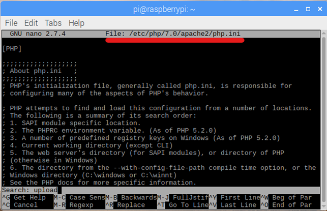
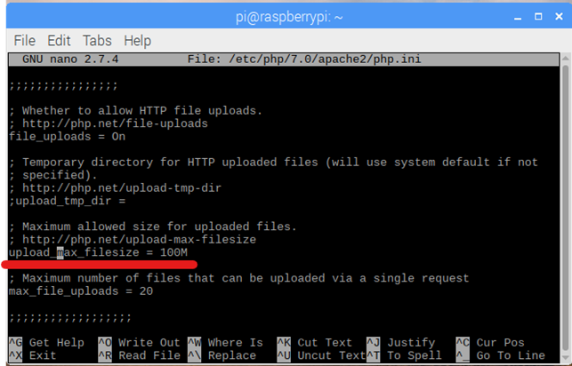
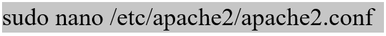

Nếu bạn đang sở hữu một máy tính Raspberry Pi và đang học PHP hoặc WordPress. Hãy biến chiếc Raspberry Pi của bạn thành một PHP Web Server. Rất đơn giản, bạn chỉ cần làm theo bài hướng dẫn dưới đây theo từng bước một. Chắc chắn bạn sẽ thành công.
<!--more-->
**I. Yêu cầu cần có:**
- Raspberry Pi
- Cài Raspbian
- Kết nối mạng qua dây hoặc wifi (ưu tiên kết nối qua dây).
**II. Cài PHP Web Server cho Raspberry Pi**
**A. Cập nhật Raspberry và cài Apache**
**1.** Trước tiên phải cập nhật phiên bản mới nhất và các gói cập nhật mới nhất cho Raspberry Pi. Copy và paste lần lượt từng dòng lệnh dưới đây:
sudo apt-get update
sudo apt-get upgrade
**2.** Cài đặt Apache:
sudo apt-get install apache2 -y
**3.** Sau khi cài đặt xong Apache, bạn có thể mở trình duyệt web (tại Raspberry) và gõ ‘localhost’nếu trang web của Apache hiện ra là thành công. Bạn cũng có thể truy cập vào website này thông qua 1 máy tính khác cùng mạng lan bằng cách gõ địa chỉ của Raspberry.
**4.** Nếu bạn muốn chỉnh sửa trang hiển thị này bạn có thể làm bằng cách sử dụng lệnh sau:
sudo nano /var/www/html/index.html
**5.** Nếu bạn có 1 website hoặc các trang tự xây dựng, bạn có thể đặt các trang đó vào thư mục html theo đường dẫn /var/www/html.
**6.** Bạn đã hoàn thành 1 Web Server rất cơ bản để sử dụng html, js hoặc css. Nếu muốn sử dụng website PHP như WordPress, Drupal,… thì bạn cần làm tiếp các bước dưới đây.
**B. Cài thư viện cho PHP**
**7.** Cài thư viện cho PHP:
sudo apt-get install php 7.0-gd php7.0-xml php7.0-curl php7.0-mcrypt php7.0-gd php7.0-mbstring
**8.** Sau khi cài đặt xong thư viện PHP, bạn có thể đặt file PHP vào thư mục html (xem bước số 5). Chúng ta hãy thử 1 ví dụ cơ bản hiện ngày giờ bằng 1 file php xem sao (nếu không muốn bạn có thể bỏ qua bước này và xem tiếp bước 11 để cài đặt MySQL). Tạo 1 file php với tên là example.php bằng cách copy và paste dòng lệnh dưới vào cmd:
sudo nano /var/www/html/example.php
**9.** Copy và paste nội dung sau vào trình soạn thảo cho file example, sau đó bấm Ctrl + X.
<?php
echo "Today's date is ".date('Y-m-d H:i:s');
?>
**10.** Bây giờ bạn hãy mở trình duyệt và thử truy cập vào localhost/example.php
**C. Cài MySQL cho PHP Web Server**
**11.** Cài đặt MySQL bằng câu lệnh dưới đây:
sudo apt-get install mysql-server php7.0-mysql -y
**12.** Trong quá trình cài đặt bạn sẽ được hỏi mật khẩu root, bạn cần đặt và nhớ để truy cập cơ sở dữ liệu sau này. (Cái này là tài khoản root của SQL và không liên quan gì tới root của Raspberry).
**13.** Nếu không được hỏi bạn có thể đặt bằng cách gõ dòng lệnh dưới đây sau khi cài thành công MySQL
sudo mysql\_secure\_installation
_\*Lưy ý: mặc định mật khẩu là trống nên khi được hỏi bạn chỉ cần bấm Enter để xác nhận._
**D. Cài WordPress vào PHP Web Server**
**14.** Bạn tải WordPress bằng cách truy cập website: [www.Wordpress.org](http://www.wordpress.org/) và tải WordPress có định dạng nén là tar.gz (mục đích là có thể giải nén ngay trên Raspberry). Hoặc bạn có thể tải các mã nguồn web mở khác như Drupal, OpenCart,…
**15.** Bạn giải nén và copy thư mục wordpress vào thư mục html theo đường dẫn /var/www/html/
**16.** Quay lại thư mục html, bạn bấm chuột phải vào thư mục html và chọn Properties, 1 cửa sổ mở lên, bạn chọn TAB Permission và thiết lập các quyền xem, sửa, xóa… thành Everyone.
**17.** Restart lại Apache bằng câu lệnh sau:
sudo service apache2 restart
**E. Tạo CSDL cho WordPress**
**18.** Để wordpress có thể hoạt động được bạn cần tạo 1 CSDL cho nó. Trước hết bạn cần đăng nhập vào MySQL bằng câu lệnh dưới đây:
sudo mysql -uroot -p123456789
_\*Lưu ý: -uroot và -p123456789 có nghĩa: User là root Password là 123456789._
**19.** Sau khi đăng nhập thành công bạn hãy tạo 1 cơ sở dữ liệu. Trong bài này mình sẽ đặt tên cơ sở dữ liệu là wordpress
create database wordpress;
**20.** Nếu sau khi sử dụng lệnh trên bạn nhìn thấy 1 dòng thông báo như sau thì bạn đã tạo 1 CSDL thành công.
Query OK, 1 row affected (0.00)
**21.** Bây giờ, bạn có thể tạo tài khoản và mật khẩu để truy cập vào CSDL vừa tạo bằng cách sử dụng dòng lệnh dưới đây:
GRANT ALL PRIVILEGES ON wordpress.\* TO 'wpdb'@'localhost'
IDENTIFIED BY 'raspberry';
_\*Lưu ý:_ _wordpress_ là tên CSDL vừa tạo – _wpdb_ là tên truy cập CSDL này –  _raspberry_ là mật khẩu để truy cập CSDL này.
**22.** Bạn hẫy bấm Ctrl + D để thoát khỏi MySQL.
**23.** Lúc này, bạn có thể truy cập vào WordPress theo địa chỉ dưới đây để cài đặt ban đầu cho WordPress
localhost/wordpress/
**24.** Đến bước này thì bạn đã hoàn thành việc cài đặt PHP Web Server và chạy được WordPress. Tuy nhiên, vẫn cần 1 – 2 thao tác nữa để việc sử dụng WordPress được thuận tiện như: cài ftp server để cho phép upload file (rất cần thiết cho việc cài đặt plugin và theme), nâng giới hạn dung lượng file upload…
**F. Cài FTP Server**
**25.** Cài FTP Server bằng câu lệnh dưới đây:
sudo apt-get install proftpd
_\*Lưu ý: khi cài đặt FTP Server bạn sẽ được hỏi có thực hiện cài đặt hay không \[Y/n\], lúc này để cài đặt bạn cần nhập chữ Y (viết hoa), nếu không viết hoa thì sẽ thoát cài đặt._
**26.** Về cơ bản thì việc cài FTP Server đã hoàn tất, tuy nhiên với cấu hình hiện tại bạn chỉ có thể truy cập vào 1 đường dẫn cụ thể (ví dụ /home/pi). Vì thế, chúng ta cần tạo 1 tài khoản ảo để thông qua FTP truy cập vào 1 vị trí cụ thể (ở đây chúng ta cần truy cập vào /var/www nơi mà chứa wordpress chúng ta đã cài ở trên).
**27.** Bạn hãy sử dụng lần lượt 2 dòng lệnh dưới đây để làm điều đó.
cd /etc/proftpd/
sudo ftpasswd --passwd --name wpftp --gid 33 --uid 33 --home /var/www/ --shell /bin/false
_\*Lưu ý: wpftp là tên để truy cập vào /var/www (bạn có thể đặt 1 tên khác nếu muốn)._
**28.** Lúc này bạn hãy đặt mật khẩu cho tài khoản wpftp.
**29.** Bây giờ bạn cần phải mở khóa toàn khoản ảo của FTP bằng cách sửa nội dung của file cấu hình, hãy truy cập vào file cấu hình bằng dòng lệnh sau:
sudo nano /etc/proftpd/proftpd.conf
**30.** File cấu hình được mở trong Terminal, bạn hãy kéo xuống cuối cùng và paste đoạn dưới đây vào:
DefaultRoot ~
AuthOrder mod\_auth\_file.c mod\_auth\_unix.c
AuthUserFile /etc/proftpd/ftpd.passwd
AuthPAM off
RequireValidShell off
**31.** Bấm Ctrl + O và Ctrl + X để save và thoát khỏi trình soạn thảo.
**32.** Vậy là đã hoàn thành việc cài đặt FTP Server, trước khi test, bạn hãy reset FTP Server bằng dòng lệnh:

**G. Truy cập FPT Server**
**33.** Mở trình duyệt và truy cập bằng cách gõ địa chỉ: fpt//raspberry và nhập user, password để truy cập Server.
**34.** Nếu vẫn không thể truy cập do các quyền bị thiếu thì bạn có thể sử dụng thêm 2 lệnh dưới đây:
chmod g+s /var/www
chmod 775 /var/www
**H. Thiết lập PHP.INI**
**35.** Tiếp theo, chúng ta sẽ sửa file php.ini để tăng giới hạn dung lượng file upload. Bạn hãy nhập vào dòng lệnh sau để mở file php.ini
sudo nano /etc/php/7.0/apache2/php.ini

**36.** Giao diện mở ra như hình trên, bây giờ bạn hãy bấm tổ hợp phím Ctrl + W để tìm kiếm từ upload.
**37.** Sau đó kéo xuống 1 chút sẽ thấy dòng Upload\_max\_filesize = 2M bạn hãy sửa thành dung lượng file mong muốn, ở đây mình để 100MB nên sửa lại là 100M. Sau đó bấm Ctrl + X, bấm Y để đồng ý Save sau đó bấm thêm phím Enter để xác nhận.

**38.** Để thay đổi có hiệu lực, bạn hãy restart lại Apache bằng câu lệnh
sudo service apache2 restart
**I. Kích hoạt chế độ Rewire cho PHP Web Server**
**39.** Kích hoạt chế độ rewrite, chức năng này cho phép bạn thay đổi Permalink trong wordpress mà không bị lỗi 404 – Page Not Found. Trước tiên, bạn cần nhập lần lượt 2 câu lệnh sau vào terminal:
sudo a2enmod rewrite
sudo service apache2 restart
**40.** Sau đó bạn truy cập vào Apache2.conf để sửa theo hướng dẫn dưới đây:

Tìm và thay toàn bộ đoạn này:
<Directory />
Options FollowSymLinks
AllowOverride None
Require all denied
</Directory>
<Directory /usr/share>
AllowOverride None
Require all granted
</Directory>
<Directory /var/www/>
Options Indexes FollowSymLinks
AllowOverride None
Require all granted
</Directory>
Bằng đoạn này
<Directory />
Options FollowSymLinks
AllowOverride None
Require all denied
</Directory>
<Directory /usr/share>
AllowOverride None
Require all granted
</Directory>
<Directory /var/www/>
Options Indexes FollowSymLinks
AllowOverride None
Require all granted
</Directory>
**41.** Sau đó restart Apache 2 bằng câu lệnh:
sudo service apache2 restart
**42.** Lúc này bạn đã hoàn tất toàn bộ quá trình làm PHP Web Server, bạn có thể truy cập Website wordpress bằng 1 máy tính khác bằng cách gõ địa chỉ của Raspberry vào thanh địa chỉ của trình duyệt web. Như ví dụ trong bài này thì địa chỉ của mình sẽ là:
Website: 192.168.100.6/wordpress/
FTP: ftp://raspberry
**Chúc bạn thành công!**
