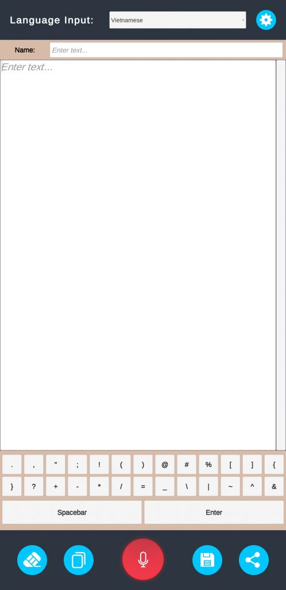
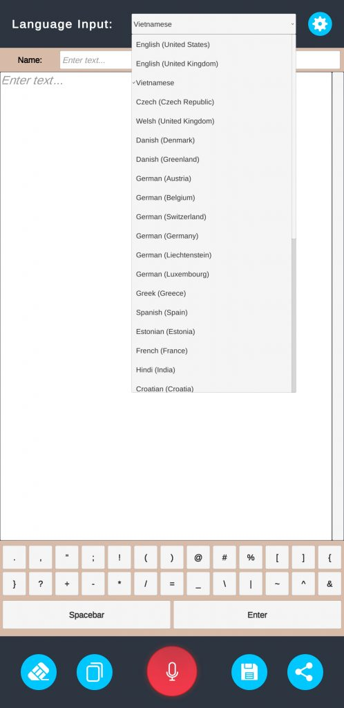
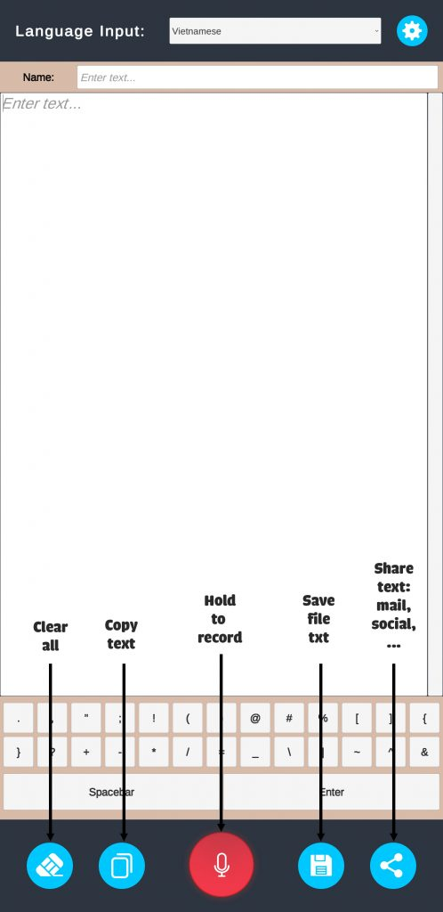

Speech to text là phần mềm hỗ trợ việc soạn thảo văn bản bằng giọng nói. Ứng dụng sử dụng cơ sở dữ liệu của Google, chính vì vậy có độ chính xác rất cao và hỗ trợ nhiều ngôn ngữ.
<!--more-->
Việc nhập văn bản, sách, truyện, viết văn,... sẽ đơn giản và nhanh chóng hơn rất nhiều với ứng dụng nhập liệu bằng giọng nói. Chỉ với chiếc smartphone, bạn có thể nhập liệu ở bất cứ nơi đâu, bất cứ lúc nào.
## **Tích hợp bàn phím phụ giúp gõ dấu nhanh hơn**
Không giống như các ứng dụng khác, ứng dụng Speech to text do EXPVN phát hành có thêm một bàn phím phụ, giúp bạn thao tác nhanh hơn. Bạn chỉ việc bấm giữ nút ghi âm, đọc đoạn văn bản sau đó thả nút ghi âm là đoạn văn bản sẽ xuất hiện. Tiếp theo, bạn có thể gõ dấu chấm, phẩy, ngoặc đơn, ngoặc kép, enter xuống dòng.v.v... Với bàn phím phụ này giúp bạn đặt dấu rất nhanh, điều mà các ứng dụng nhập liệu khác không có.

Giao diện ứng dụng Speech to text
## **Hỗ trợ nhập liệu đa ngôn ngữ trong một văn bản**
Không giống các ứng dụng nhập liệu bằng giọng nói khác. Speech to text do EXPVN phát hành có thêm một chức năng đặc biệt, đó là bạn có thể chuyển đổi ngôn ngữ bất kỳ lúc nào. Điều này giúp bạn có thể nhập liệu đa ngôn ngữ trong một văn bản. Ứng dụng sử dụng cơ sở dữ liệu của Google nên hỗ trợ rất nhiều ngôn ngữ khác nhau.

Speech to text hỗ trợ nhiều ngôn ngữ khác nhau
## **Dễ dàng sử dụng văn bản sau khi nhập liệu**
Sau khi nhập liệu bằng Speech to text, bạn có nhiều lựa chọn để xử lý văn bản mà bạn vừa nhập như:
- Copy: Văn bản sẽ được copy vào clipboard, sẵn sàng để bạn paste ở bất cứ đâu.
- Save file: Văn bản sẽ được lưu lại thành file .txt ở thư SpeechToText trong bộ nhớ chính.
- Share: Văn bản sẽ được share qua mail, facebook, zalo, viber... hoặc bất cứ ứng dụng hỗ trợ nhập văn bản.

4 nút chức năng giúp bạn dễ dàng sử dụng văn bản đã nhập.
## **DOWNLOAD**
Click vào nút dưới đây để tải ứng dụng:
[Download: **Speech to text**](https://play.google.com/store/apps/details?id=com.EXPGames.Speechtotext)
