Nếu bạn đang sở hữu một máy đọc sách, hoặc muốn tạo sách điện tử và copy vào điện thoại, máy tính bảng để đọc mà công cần kết nối internet thì bài viết này dành cho bạn. Ở bài này, mình sẽ hướng dẫn các bạn tạo ebook dạng azw3, epub bằng Calibre Book Edit.
<!--more-->
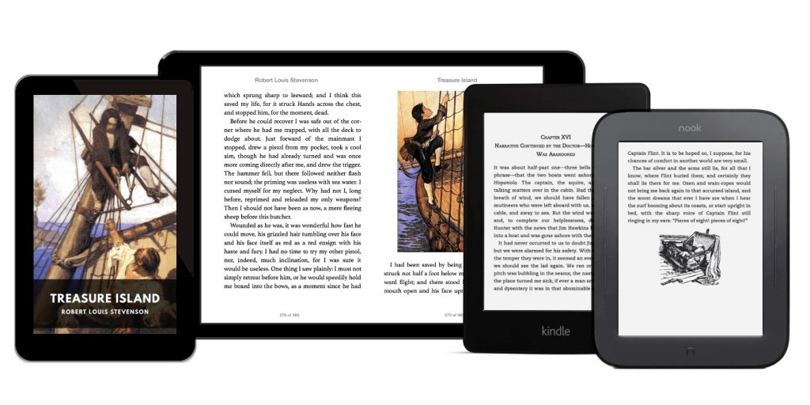
**I. Tại sao lại chọn azw3 và epub để tạo sách điện tử**
- **azw3 (hay azw)** là định dạng của Amazon. Họ sử dụng định dạng này trên các thiết bị đọc sách của họ. Với định dạng azw3 bạn có thể sử dụng nhiều kiểu chữ, và nhiều kiểu định dạng khác nhau. Ngoài ra định dạng này còn hỗ trợ cả video và âm thanh. Vì là định dạng sách của Amazon nên nó chỉ phổ biển trên các thiết bị của Amazon. Các máy đọc sách khác như: nook, kobo không sử dụng được định dạng này. Đối với các thiết bị như: Android, iOS, PC, có thể cài thêm phần mềm để đọc dạng sách này.
- **epub** là định dạng ebook phổ biến nhất trên thế giới. Lý do epub là một định dạng mở, sử dụng miễn phí và không có nhà cung cấp độc quyền. Định dạng epub cũng hỗ trợ hình ảnh, đồ họa SVG, các yếu tố tương tác hay cả video. Vì tính phổ biến của nó, bạn có thể đọc định dạng này trên các loại máy đọc sách. Riêng Kindle không hỗ trợ đọc sách định dạng này. Với các máy như: Android, iOS, PC bạn cần cài thêm phần mềm để đọc được định dạng sách này.
**II. Sử dụng phần mềm nào để đọc ebook trên PC**
- Bạn nên sử dụng Calibre để quản lý và đọc sách điện tử. Ngoài ra, Calibre còn có thể chuyển đổi định dạng sách qua lại giữa nhiều định dạng.
- Nếu bạn chưa dùng Calibre bao giờ sẽ thấy hơi khó khăn. Tuy nhiên, dần dần bạn sẽ thấy đây là một phần mềm quản lý và đọc sách vô cùng tốt.
- Ở bài viết này. Mình sẽ hướng dẫn các bạn sử dụng Book Edit của Calibre để tạo ebook dạng azw3 hoặc epub.
- Để tải Calibre, bạn click vào liên kết sau đây: [https://calibre-ebook.com/download](https://calibre-ebook.com/download)
- Bạn chọn phiên bản phù hợp với máy tính của mình. Sau khi tải và cài đặt, hãy bắt đầu tạo sách.
**_Lưu ý:_** _bạn cần nhớ vị trí cài đặt của phần mềm._
**III. Tạo Ebook dạng azw3, epub**
**1\. Tạo ebook mới dạng azw3 (epub làm tương tự)**
- Đầu tiên, bạn hãy vào thư mục cài đặt của Calibre. trong đó có 3 thư mục là: Calibre, Calibre Library, Calibre Settings. Bạn hãy vào thư mục Calibre và tìm Book-Edit. Xem hình H1.
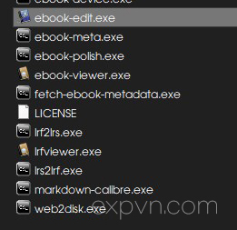 H1. Vị trí của Book edit trong thư mục Calibre
**_\*Lưu ý:_** _Click vào hình để xem rõ hơn_, sử dụng mũi tên sang trái/phải để xem từng bước. Bạn chỉ cần xem hình và làm theo từng bước cũng đạt được kết quả tương tự.
- Bạn click đúp để mở phần mềm này lên. Giao diện hiện ra sẽ giống như hình H2.
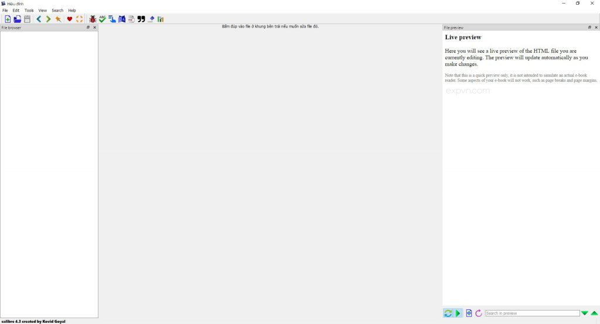 H2. Giao diện của Book Edit
- Để tạo ebook mới, bạn bấm vào Menu File> chọn Create new, empty book
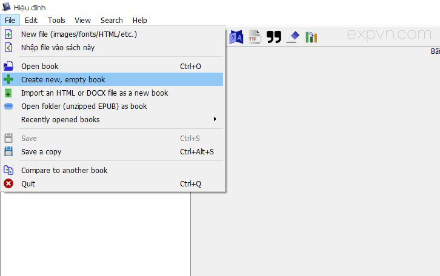 H3. Tạo một ebook mới
- Sau khi bạn tạo một ebook mới. Một cửa sổ hiện ra, bạn hãy điền tên sách và tên tác giả. Chọn ngôn ngữ là Tiếng Việt với sách được viết bằng tiếng Việt.
- Bây giờ, bạn hãy nhìn xuống dưới và thấy có 3 nút. Bạn hãy chọn Epub hoặc Azw3 tùy vào nhu cầu của mình.
- **_Gợi ý:_** _Nếu bạn sở hữu một máy Kindle, bạn hãy tạo sách azw3. Còn lại, bạn hãy tạo Epub nhé._
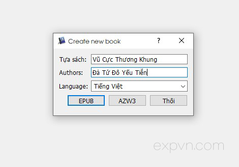 H4. Chọn sách epub hay azw3 tùy vào nhu cầu của bạn
- Khi bạn chọn định dạng epub hoặc azw3 xong thì một cửa sổ hiện lên. Lúc này, bạn chọn vị trí lưu sách.
- **_Gợi ý:_** _bạn nên lưu ra desktop cho dễ tìm. Sau này làm xong bạn có thể di chuyển nó sang chỗ khác cho dễ quản lý._
- Hãy đặt tên sách (mũi tên 1) và bấm Save (mũi tên 2). Trong ví dụ này, mình sẽ tạo ebook với định dạng azw3. Với dạng Epub, các bạn làm tương tự.
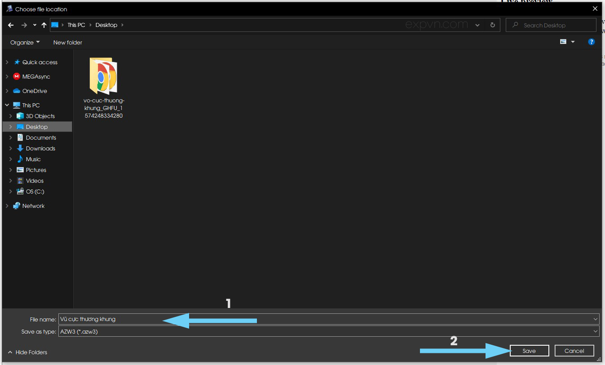 H5. Lưu tên sách với định dạng azw3 hoặc epub được chọn trước đó
**2\. Bước chuẩn bị nội dung cho sách điện tử azw3 (epub làm tương tự)**
- Hình dưới là giao diện của một ebook mới được tạo. Các thành phần gồm có: Văn bản (gồm các file truyện); Style (là file CSS để định dạng); Image (là các file ảnh trong truyện, bao gồm cả ảnh bìa); Fonts (là font chữ của truyện); Khác (TOC là mục lục).
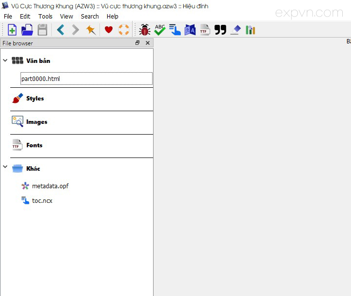 H6. Giao diện của một ebook mới được tạo
- Khi mới tạo ebook, sẽ có một file mẫu trống ban đầu để bạn copy sách. Để thống nhất các chương sau này, bạn hãy bấm chuột phải và xóa file mẫu này đi. (Xem H7).
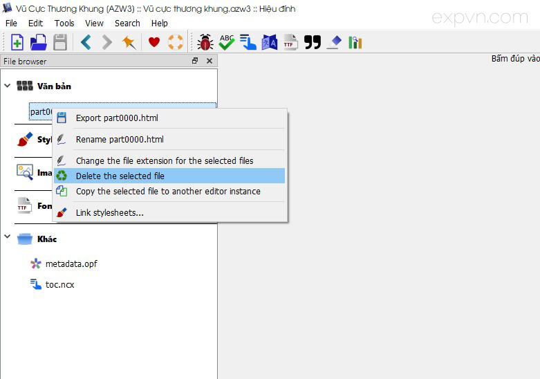 H7. Xóa file mẫu
**3\. Copy nội dung vào ebook azw3 (epub làm tương tự)**
- Nếu bạn đã có sẵn nội dung file sách/truyện được lưu ở dạng html thì bạn hãy bỏ qua bước này và xem tiếp bước 4.
- Bạn hãy vào Menu File> chọn New file để bắt đầu tạo ra các chương cho sách/truyện của mình.
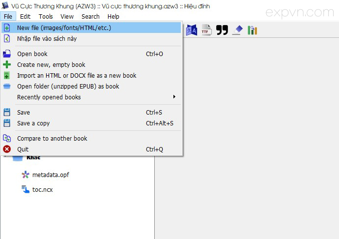 H8. Tạo một chương sách mới
- Một cửa sổ hiện ra. Bạn hãy nhập tên chương vào.
- _Ví dụ: Chương 1: Bắt đầu.html_
- _Lưu ý:_ cuối tên các chương phải có phần đuôi là .html
- Bấm OK để kết thúc việc đặt tên.
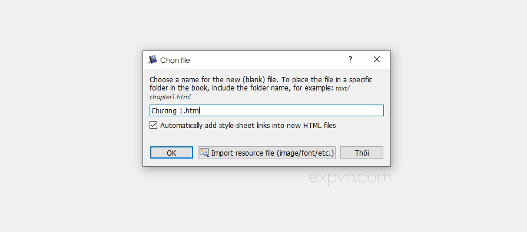 H9. đặt tên cho từng chương
- Sau khi tạo ra các chương sách/truyện. Bạn hãy copy nội dung vào từng chương.
- Click đúp vào chương và hình vào phần soạn thảo. Bạn sẽ thấy phần mã Body. Bạn hãy Paste nội dung vào giữa thẻ này.
<body>
Paste nội dung vào đây...
</body>
 H10. Copy nội dung sách vào các chương
- Bạn làm tương tự với các chương khác, lần lượt cho tới hết tất cả các chương.
- Nếu bạn làm theo cách này, bạn hãy bỏ qua bước 4 và xem tiếp bước 5.
**4\. Import nội dung sách/truyện vào ebook azw3 (epub)**
- Nếu bạn đã có sẵn các file truyện ở dạng html thì bạn chỉ việc nhập vào ebook.
- Để tải nội dung sách/truyện về, bạn tham khảo bài viết sau: [https://expvn.com/phan-mem-tai-truyen-chu-gettextfromhtml/](https://expvn.com/phan-mem-tai-truyen-chu-gettextfromhtml/) (click để mở một cửa sổ mới)
- Chọn Menu File> Nhập file vào sách này.
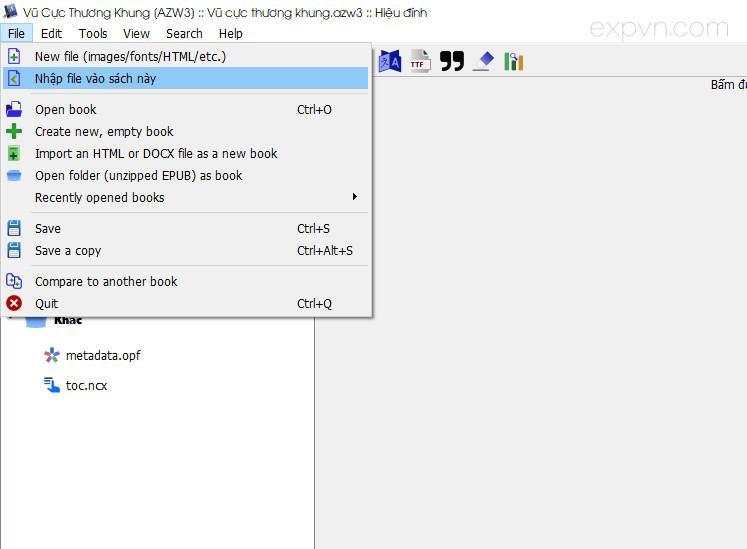 H11. Nhập nội dung có sẵn vào ebook
- Hãy tìm đến nơi bạn lưu trữ các file nội dung dạng html mà bạn đã tải về trước đó.
- Bấm Ctrl + A để chọn tất cả file rồi bấm Open để nhập các file này vào ebook azw3
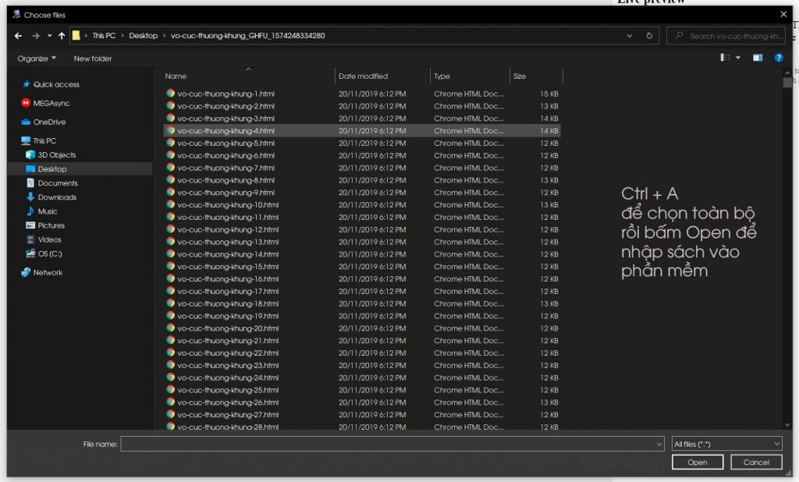 12. Chọn nội dung cần nhập
**5\. Chèn bìa sách cho ebook Azw3 (epub)**
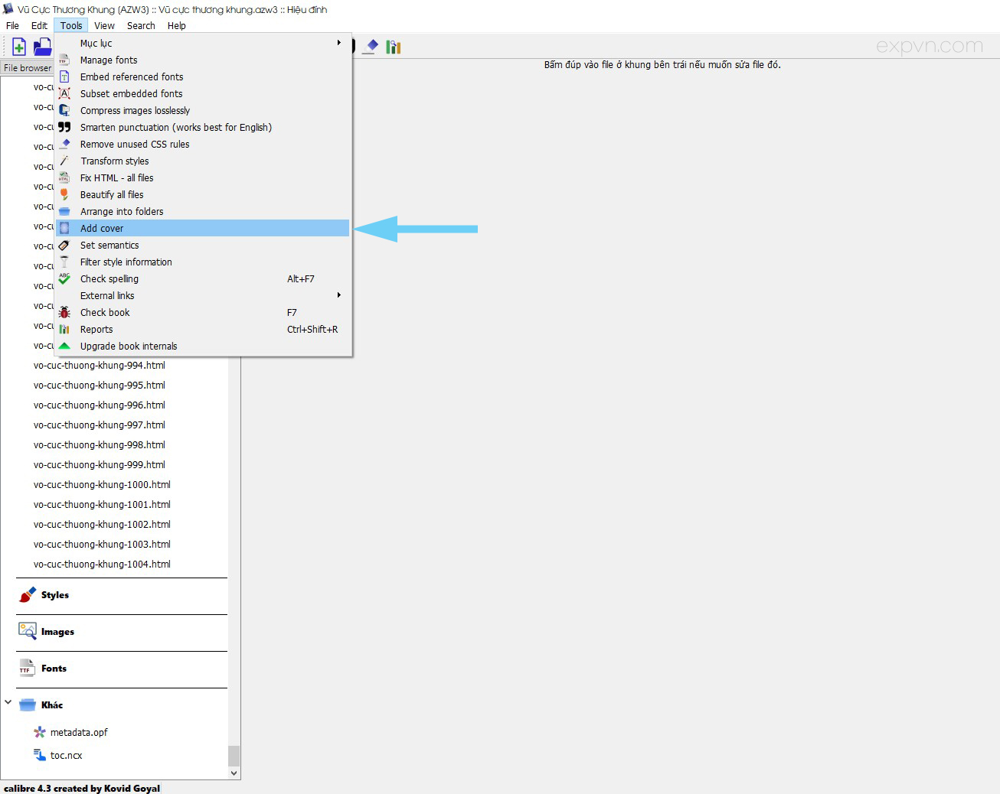 H13. thêm bìa sách vào ebook
 H14. Chọn import để thêm bìa sách
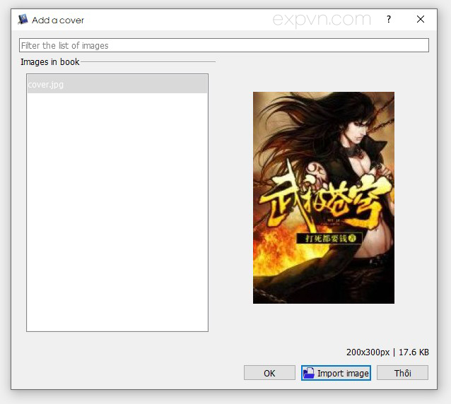 H15. Hiển thị bìa sách mà bạn đã chọn
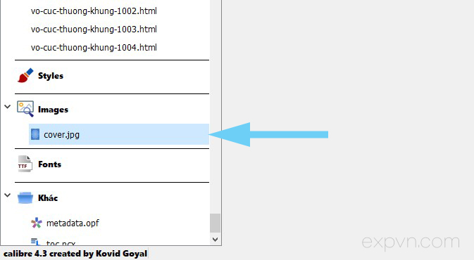 H16. Bìa sách sẽ nằm ở mục Image
**6\. Tạo file CSS để bố cục ebook azw3 (epub)**
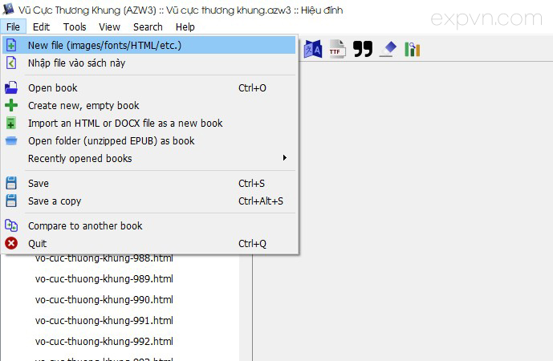 H17. Tạo một file CSS để bố cục cho ebook
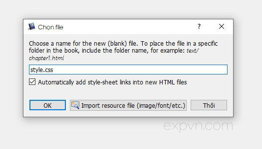 H18. Nhập tên file CSS
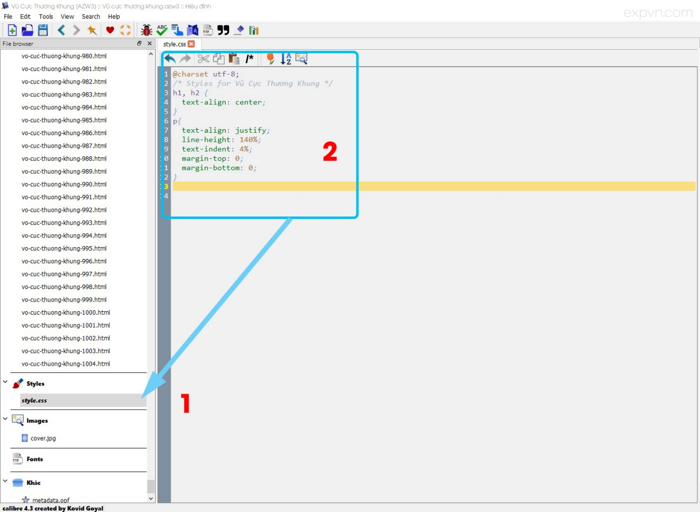 H19. Bố cục cho ebook bằng CSS
 H20. Liên kết các file html vào css đã tạo
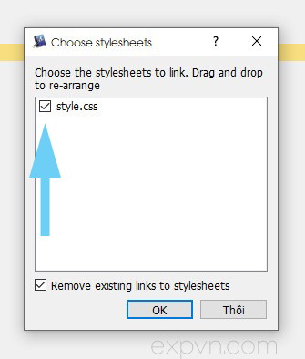 H21. Chọn file css để liên kết
**7\. Tạo mục lục cho ebook azw3 (epub)**
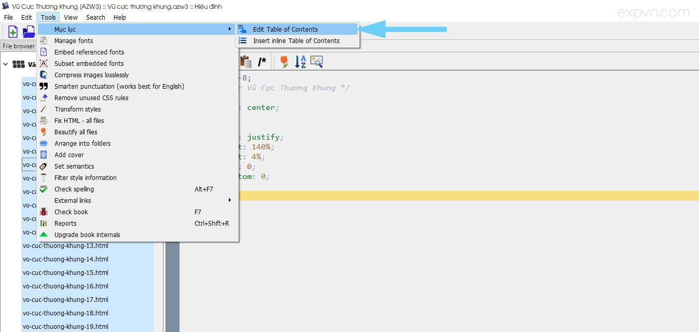 H22. Tạo mục lục tự động cho ebook azw3 epub
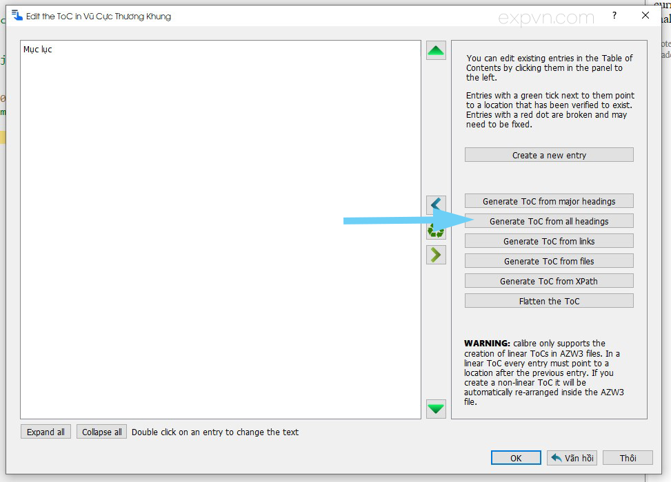 H23. Tự động lấy tiêu đề làm mục lục
 H24. Tự động xóa trùng lặp
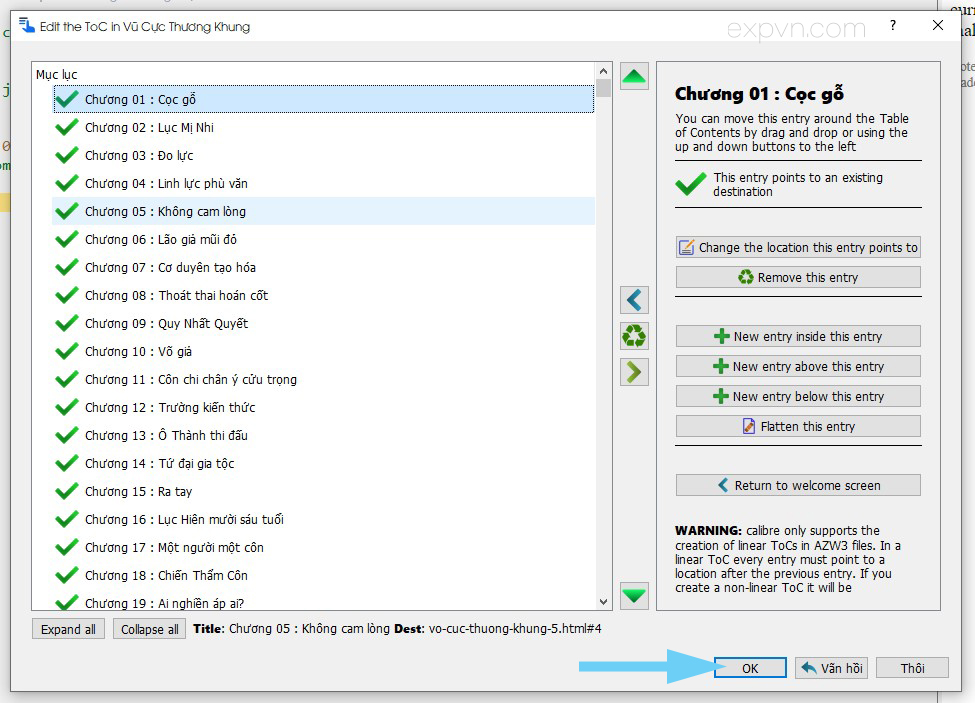 H25. Chèn mục lục thành công
**8\. Hoàn thành việc tạo ebook dạng azw3 (epub)**
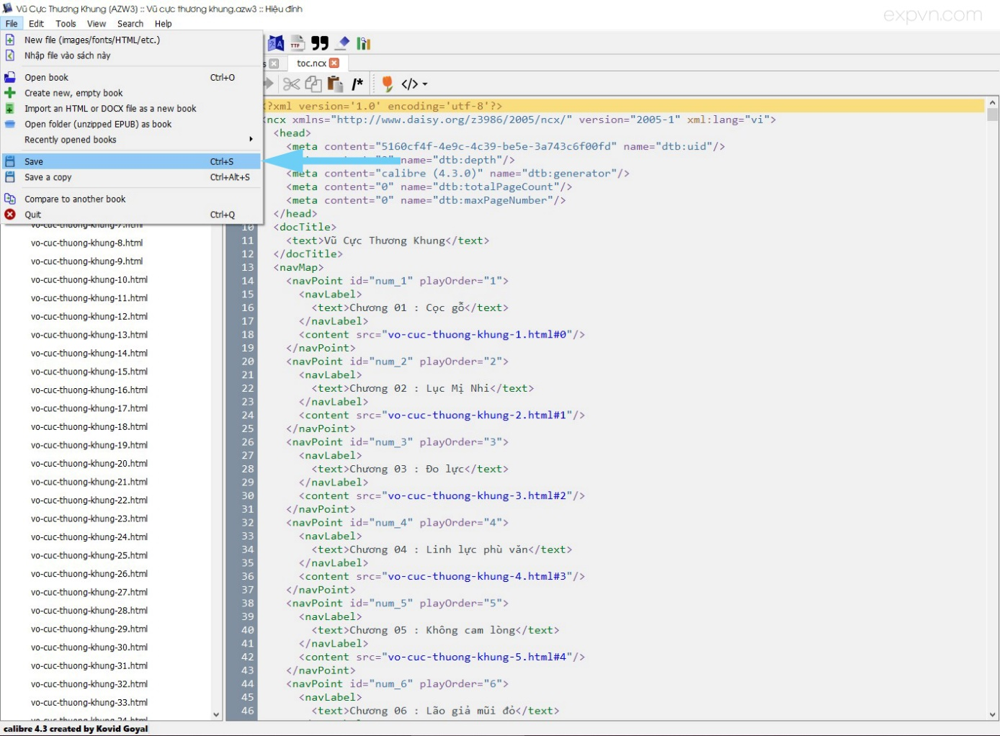 H26. Lưu sách azw3 epub lại
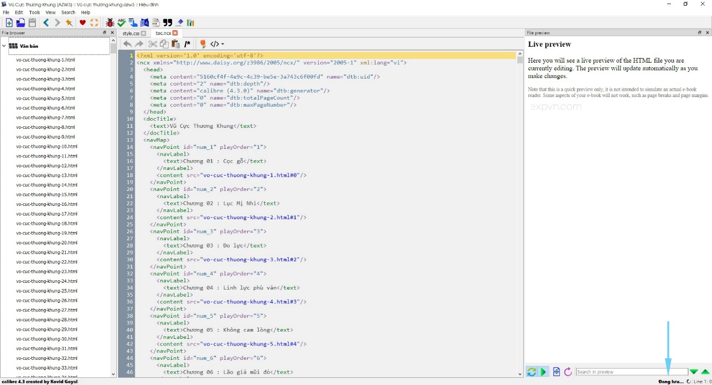 H27. Dòng trạng thái, đang lưu sách điện tử
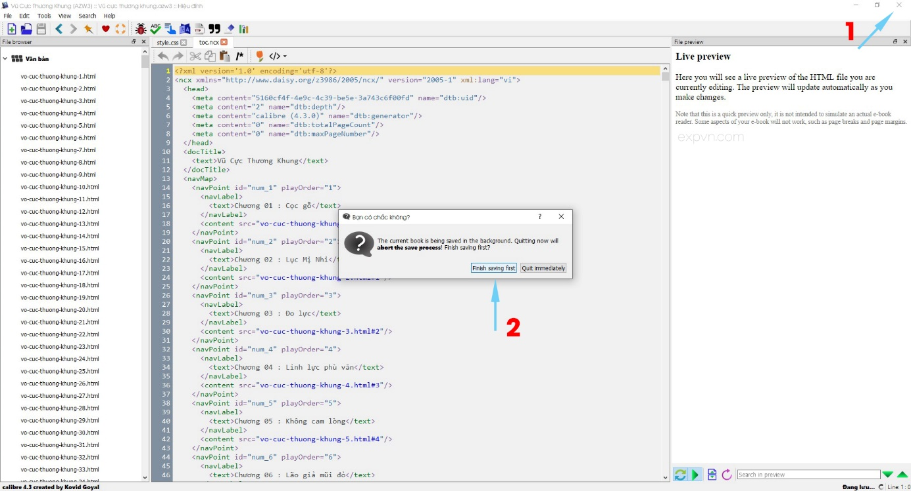 H28. Nếu tắt đi khi chưa lưu xong, book edit sẽ hỏi bạn có muốn lưu trước khi tắt không
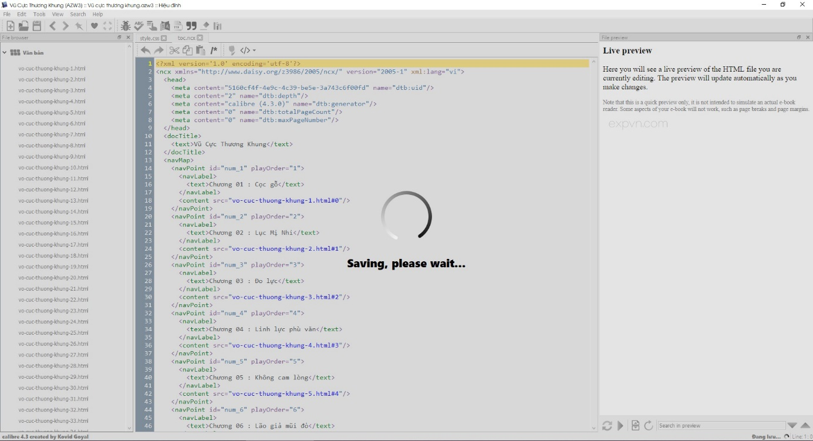 H29. Lưu sách trước khi thoát book edit
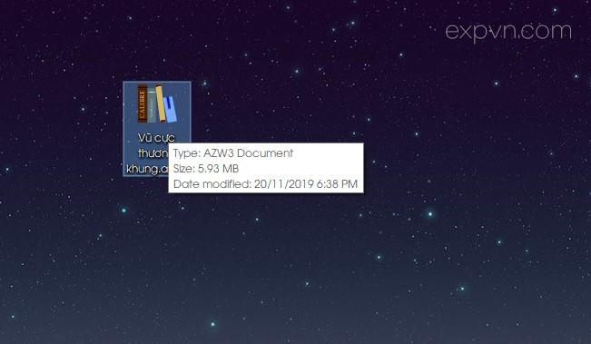 H30. Tạo ebook dạng azw3 epub thành công
